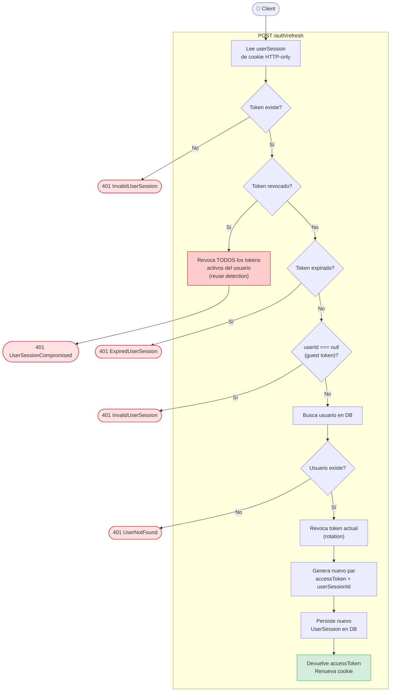

# Refresh — Use Case Diagram

## Reglas de negocio

| Regla | Descripción |
|---|---|
| Token rotation | Cada refresh revoca el token usado y genera uno nuevo |
| Reuse detection | Si el token presentado ya estaba revocado → revocar TODOS los del usuario |
| Guest tokens | Los tokens con `userId = null` no pueden renovarse |
| Idempotencia | Si el token ya expiró o no existe → 401 sin efectos secundarios |
