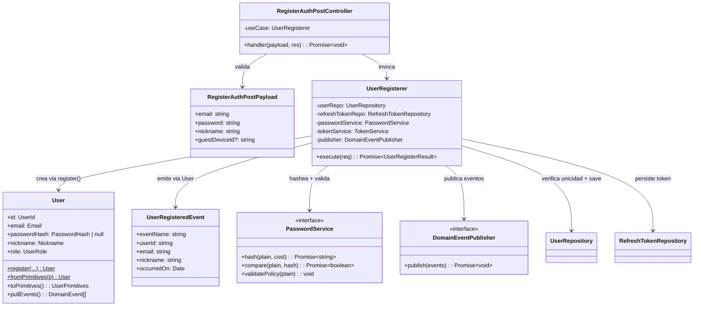

# Register — Diagrama de Clases

> Artefactos involucrados en `POST /auth/register`

```mermaid
classDiagram
    class RegisterAuthPostController {
        -useCase: UserRegisterer
        +handler(payload, res): Promise~void~
    }

    class RegisterAuthPostPayload {
        +email: string
        +password: string
        +nickname: string
        +guestDeviceId?: string
    }

    class UserRegisterer {
        -userRepo: UserRepository
        -refreshTokenRepo: RefreshTokenRepository
        -passwordService: PasswordService
        -tokenService: TokenService
        -publisher: DomainEventPublisher
        +execute(req): Promise~UserRegisterResult~
    }

    class User {
        +id: UserId
        +email: Email
        +passwordHash: PasswordHash | null
        +nickname: Nickname
        +role: UserRole
        +register(...)$ User
        +fromPrimitives(p)$ User
        +toPrimitives(): UserPrimitives
        +pullEvents(): DomainEvent[]
    }

    class UserRegisteredEvent {
        +eventName: string
        +userId: string
        +email: string
        +nickname: string
        +occurredOn: Date
    }

    class PasswordService {
        <<interface>>
        +hash(plain, cost): Promise~string~
        +compare(plain, hash): Promise~boolean~
        +validatePolicy(plain): void
    }

    class DomainEventPublisher {
        <<interface>>
        +publish(events): Promise~void~
    }

    RegisterAuthPostController --> RegisterAuthPostPayload : valida
    RegisterAuthPostController --> UserRegisterer : invoca
    UserRegisterer --> User : crea via register()
    UserRegisterer --> UserRegisteredEvent : emite via User
    UserRegisterer --> PasswordService : hashea + valida
    UserRegisterer --> DomainEventPublisher : publica eventos
    UserRegisterer --> UserRepository : verifica unicidad + save
    UserRegisterer --> RefreshTokenRepository : persiste token
```
