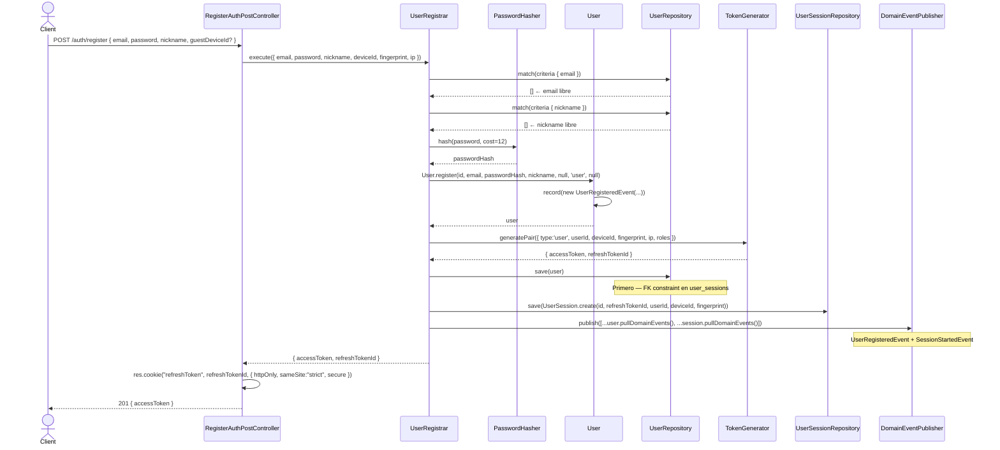
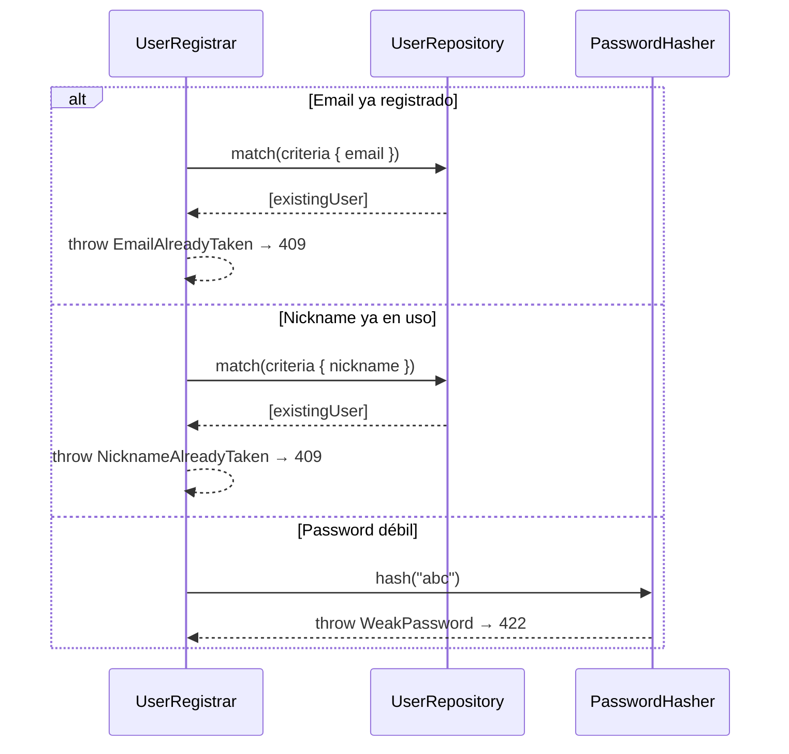

# Register — Diagrama de Secuencia

> `POST /auth/register` — controller → use case → domain → persistence

## Flujo exitoso

```mermaid
sequenceDiagram
    actor Client
    participant C as RegisterAuthPostController
    participant UC as UserRegistrar
    participant PH as PasswordHasher
    participant U as User
    participant UREPO as UserRepository
    participant TG as TokenGenerator
    participant RTREPO as UserSessionRepository
    participant PUB as DomainEventPublisher

    Client->>C: POST /auth/register { email, password, nickname, guestDeviceId? }

    C->>UC: execute({ email, password, nickname, deviceId, fingerprint, ip })

    UC->>UREPO: match(criteria { email })
    UREPO-->>UC: [] ← email libre

    UC->>UREPO: match(criteria { nickname })
    UREPO-->>UC: [] ← nickname libre

    UC->>PH: hash(password, cost=12)
    PH-->>UC: passwordHash

    UC->>U: User.register(id, email, passwordHash, nickname, null, 'user', null)
    U->>U: record(new UserRegisteredEvent(...))
    U-->>UC: user

    UC->>TG: generatePair({ type:'user', userId, deviceId, fingerprint, ip, roles })
    TG-->>UC: { accessToken, refreshTokenId }

    UC->>UREPO: save(user)
    Note over UREPO: Primero — FK constraint en user_sessions

    UC->>RTREPO: save(UserSession.create(id, refreshTokenId, userId, deviceId, fingerprint))

    UC->>PUB: publish([...user.pullDomainEvents(), ...session.pullDomainEvents()])
    Note over PUB: UserRegisteredEvent + SessionStartedEvent

    UC-->>C: { accessToken, refreshTokenId }
    C->>C: res.cookie("refreshToken", refreshTokenId, { httpOnly, sameSite:"strict", secure })
    C-->>Client: 201 { accessToken }
```

## Flujos de error

```mermaid
sequenceDiagram
    participant UC as UserRegistrar
    participant UREPO as UserRepository
    participant PH as PasswordHasher

    alt Email ya registrado
        UC->>UREPO: match(criteria { email })
        UREPO-->>UC: [existingUser]
        UC-->>UC: throw EmailAlreadyTaken → 409
    else Nickname ya en uso
        UC->>UREPO: match(criteria { nickname })
        UREPO-->>UC: [existingUser]
        UC-->>UC: throw NicknameAlreadyTaken → 409
    else Password débil
        UC->>PH: hash("abc")
        PH-->>UC: throw WeakPassword → 422
    end
```
