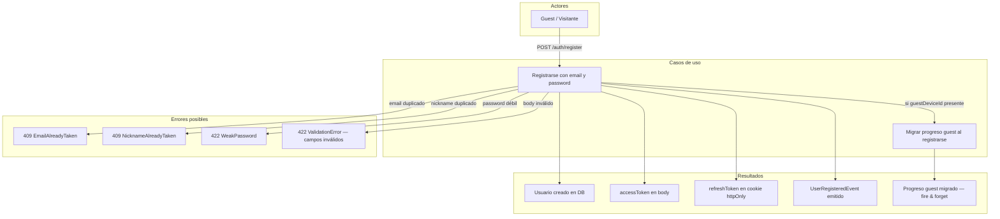

# Register — Diagrama de Casos de Uso

> Actores y escenarios de `POST /auth/register`

```mermaid
graph TD
    subgraph Actores
        G[Guest / Visitante]
    end

    subgraph Casos de uso
        UC1[Registrarse con email y password]
        UC2[Migrar progreso guest al registrarse]
    end

    subgraph Resultados
        R1[Usuario creado en DB]
        R2[accessToken en body]
        R3[refreshToken en cookie httpOnly]
        R4[UserRegisteredEvent emitido]
        R5[Progreso guest migrado — fire & forget]
    end

    subgraph Errores posibles
        E1[409 EmailAlreadyTaken]
        E2[409 NicknameAlreadyTaken]
        E3[422 WeakPassword]
        E4[422 ValidationError — campos inválidos]
    end

    G -->|POST /auth/register| UC1
    UC1 -->|si guestDeviceId presente| UC2

    UC1 --> R1
    UC1 --> R2
    UC1 --> R3
    UC1 --> R4
    UC2 --> R5

    UC1 -->|email duplicado| E1
    UC1 -->|nickname duplicado| E2
    UC1 -->|password débil| E3
    UC1 -->|body inválido| E4
```
