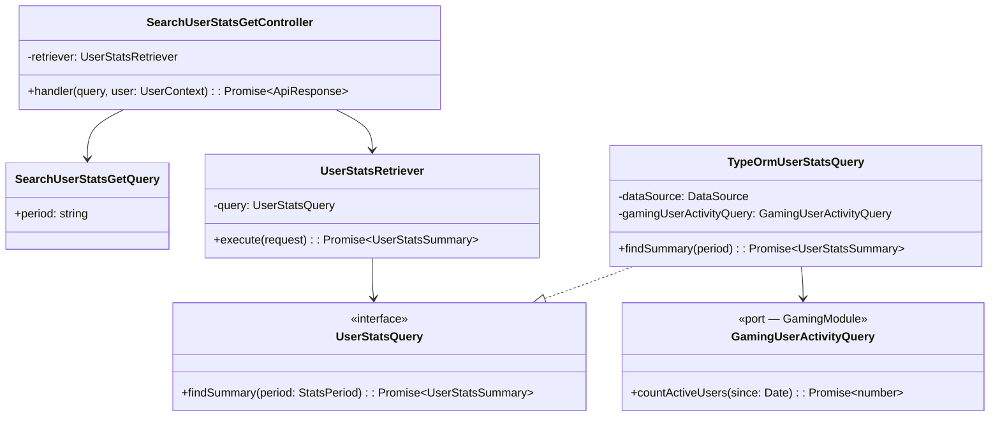

# User Stats — Diagrama de Clases

```mermaid
classDiagram
    class SearchUserStatsGetController {
        -retriever: UserStatsRetriever
        +handler(query, user: UserContext): Promise~ApiResponse~
    }

    class SearchUserStatsGetQuery {
        +period: string
    }

    class UserStatsRetriever {
        -query: UserStatsQuery
        +execute(request): Promise~UserStatsSummary~
    }

    class UserStatsQuery {
        <<interface>>
        +findSummary(period: StatsPeriod): Promise~UserStatsSummary~
    }

    class TypeOrmUserStatsQuery {
        -dataSource: DataSource
        -gamingUserActivityQuery: GamingUserActivityQuery
        +findSummary(period): Promise~UserStatsSummary~
    }

    class GamingUserActivityQuery {
        <<port — GamingModule>>
        +countActiveUsers(since: Date): Promise~number~
    }

    SearchUserStatsGetController --> UserStatsRetriever
    SearchUserStatsGetController --> SearchUserStatsGetQuery
    UserStatsRetriever --> UserStatsQuery
    TypeOrmUserStatsQuery ..|> UserStatsQuery
    TypeOrmUserStatsQuery --> GamingUserActivityQuery
```
