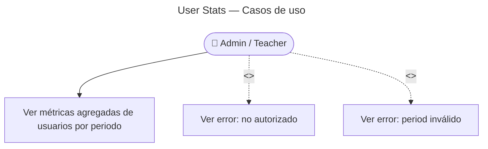

# User Stats — Casos de Uso

## Reglas de negocio

| Regla | Detalle |
|-------|---------|
| Auth | JWT + rol `admin` (403 si no admin) |
| Period | Enum validado en `SearchUserStatsGetQuery` |
| Cross-BC | Actividad gaming vía `GamingUserActivityQuery` exportado por GamingModule |
| Envelope | `{ data: UserStatsSummary, meta }` |
| Uso | Backoffice / dashboards internos |
