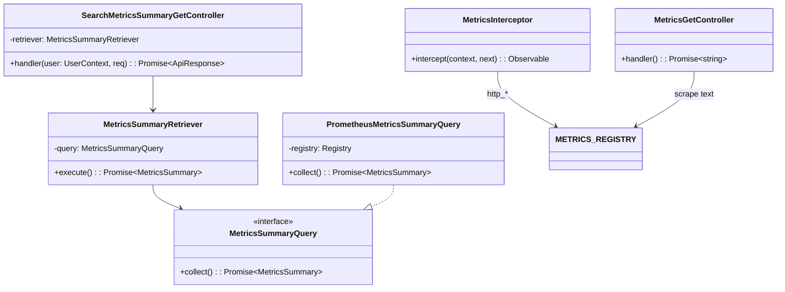

# Metrics Summary — Diagrama de Clases

```mermaid
classDiagram
    class SearchMetricsSummaryGetController {
        -retriever: MetricsSummaryRetriever
        +handler(user: UserContext, req): Promise~ApiResponse~
    }

    class MetricsSummaryRetriever {
        -query: MetricsSummaryQuery
        +execute(): Promise~MetricsSummary~
    }

    class MetricsSummaryQuery {
        <<interface>>
        +collect(): Promise~MetricsSummary~
    }

    class PrometheusMetricsSummaryQuery {
        -registry: Registry
        +collect(): Promise~MetricsSummary~
    }

    class MetricsInterceptor {
        +intercept(context, next): Observable
    }

    class MetricsGetController {
        +handler(): Promise~string~
    }

    SearchMetricsSummaryGetController --> MetricsSummaryRetriever
    MetricsSummaryRetriever --> MetricsSummaryQuery
    PrometheusMetricsSummaryQuery ..|> MetricsSummaryQuery
    MetricsInterceptor --> METRICS_REGISTRY : http_*
    MetricsGetController --> METRICS_REGISTRY : scrape text
```

`MetricsInterceptor` y `MetricsGetController` no participan en el JSON summary pero alimentan el mismo registry.
