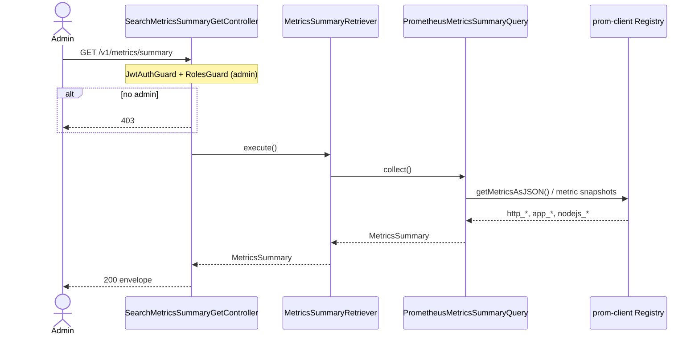
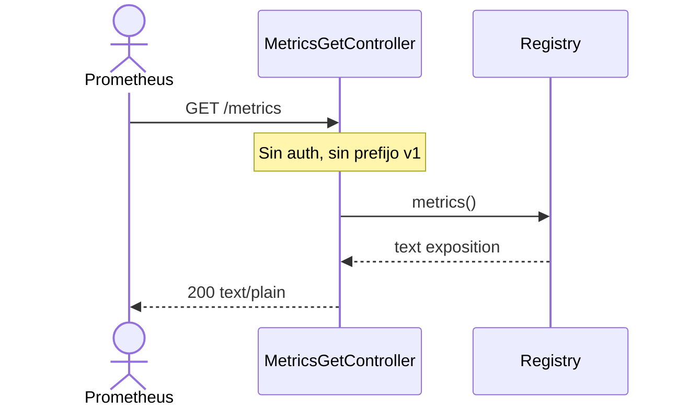

# Metrics Summary — Diagrama de Secuencia

## Scrape Prometheus (relacionado)

## Instrumentación automática

Cada request HTTP pasa por `MetricsInterceptor` → incrementa `http_requests_total` y `http_request_duration_seconds`.
