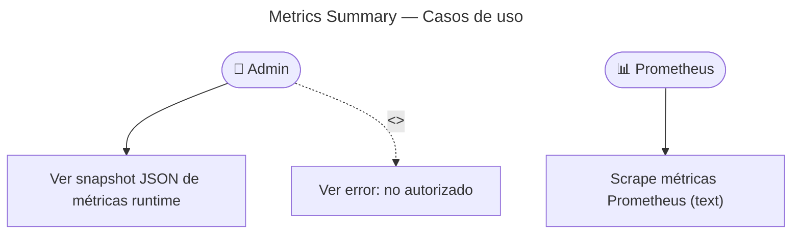

# Metrics Summary — Casos de Uso

## Reglas de negocio

| Regla | Detalle |
|-------|---------|
| JSON summary | JWT admin — envelope `{ data: { metrics }, meta }` |
| Scrape | `GET /metrics` público para Prometheus |
| HTTP metrics | Automáticas vía `MetricsInterceptor` |
| Business metrics | `app_*` incrementadas en use cases (games, auth, audio, …) |
| Runtime | `collectDefaultMetrics()` — Node.js process stats |

## Métricas `app_*` principales

| Métrica | Emisor |
|---------|--------|
| `app_games_started_total` | `GameStarter` |
| `app_games_completed_total` | `GameCompleter` |
| `app_auth_logins_total{provider}` | `UserAuthenticator`, `OAuthAuthenticator` |
| `app_flashcards_created_total` | `FlashcardCreator` |
| `app_audio_generated_total` | `FlashcardAudioGenerator` |
