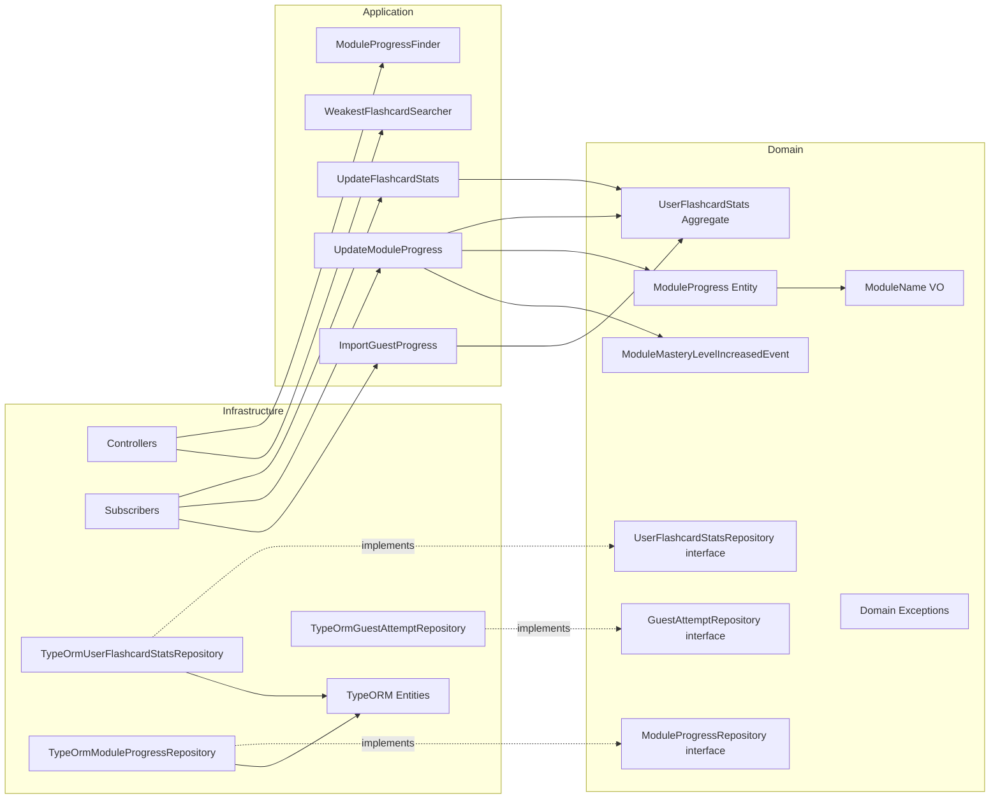

# Progress BC — Documentación

> Bounded Context responsable de materializar el progreso del usuario por flashcard y por módulo a partir de eventos de Gaming e Identity.

## Flujos de negocio

Cada flujo tiene 3 diagramas: secuencia, clases y casos de uso.

| Flujo | Descripción | Diagramas |
|---|---|---|
| [Find Modules](./find-modules/) | Consultar progreso por módulo del usuario autenticado | [Secuencia](./find-modules/sequence.md) · [Clases](./find-modules/classes.md) · [Casos de uso](./find-modules/usecases.md) |
| [Weakest Flashcards](./weakest-flashcards/) | Consultar flashcards con menor accuracy del usuario | [Secuencia](./weakest-flashcards/sequence.md) · [Clases](./weakest-flashcards/classes.md) · [Casos de uso](./weakest-flashcards/usecases.md) |
| [Find Subcategories](./find-subcategories/) | Agregación on-read de precisión por subcategoría | [Secuencia](./find-subcategories/sequence.md) · [Casos de uso](./find-subcategories/usecases.md) |
| [Update Flashcard Stats](./update-flashcard-stats/) | Actualizar estadísticas por flashcard al recibir `AttemptRecorded` | [Secuencia](./update-flashcard-stats/sequence.md) · [Clases](./update-flashcard-stats/classes.md) · [Casos de uso](./update-flashcard-stats/usecases.md) |
| [Update Module Progress](./update-module-progress/) | Recalcular progreso de módulo al recibir `GameCompleted` | [Secuencia](./update-module-progress/sequence.md) · [Clases](./update-module-progress/classes.md) · [Casos de uso](./update-module-progress/usecases.md) |
| [Import Guest Progress](./import-guest-progress/) | Importar historial de intentos del guest al registrarse | [Secuencia](./import-guest-progress/sequence.md) · [Clases](./import-guest-progress/classes.md) · [Casos de uso](./import-guest-progress/usecases.md) |

---

## Mapa de endpoints

| Método | Ruta | Flujo | Auth |
|---|---|---|---|
| `GET` | `/progress/modules` | [Find Modules](./find-modules/) | JWT |
| `GET` | `/progress/flashcards/weakest?limit=N` | [Weakest Flashcards](./weakest-flashcards/) | JWT |

---

## Subscribers AMQP

| Evento | Exchange | Flujo |
|---|---|---|
| `AttemptRecorded` | `ididntcatchthat.gaming.attempts.attempt.recorded` | [Update Flashcard Stats](./update-flashcard-stats/) |
| `GameCompleted` | `ididntcatchthat.gaming.games.game.completed` | [Update Module Progress](./update-module-progress/) |
| `GuestProgressMigrated` | `idct.identity.users.guest_progress.migrated` | [Import Guest Progress](./import-guest-progress/) |

---

## Arquitectura general

> **Regla de dependencias**: `Infrastructure` → `Application` → `Domain`. Nunca al revés.

---

## Domain Events

| Evento | Exchange | Trigger |
|---|---|---|
| `ModuleMasteryLevelIncreasedEvent` | `idct.progress.module_progress.module_mastery_level.increased` | `masteryLevel` sube al recalcular `ModuleProgress` |

---

## Referencias

- [Domain doc: Progress](../../../domain/progress.md)
- [Spec de Progress](../../../spec/progress.md)
- [Tasks](../../../tasks/progress.md)
- [Domain Model](../../../domain/domain-model.md)
