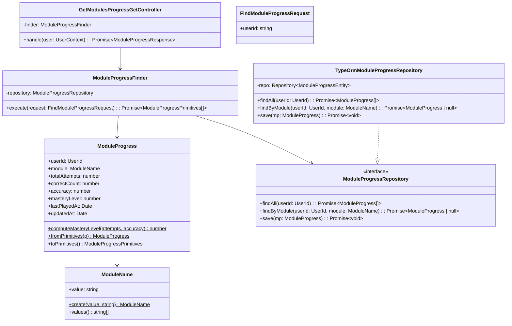

# Find Modules Progress — Diagrama de Clases

```mermaid
classDiagram
    class GetModulesProgressGetController {
        -finder: ModuleProgressFinder
        +handle(user: UserContext): Promise~ModuleProgressResponse~
    }

    class ModuleProgressFinder {
        -repository: ModuleProgressRepository
        +execute(request: FindModuleProgressRequest): Promise~ModuleProgressPrimitives[]~
    }

    class FindModuleProgressRequest {
        +userId: string
    }

    class ModuleProgress {
        +userId: UserId
        +module: ModuleName
        +totalAttempts: number
        +correctCount: number
        +accuracy: number
        +masteryLevel: number
        +lastPlayedAt: Date
        +updatedAt: Date
        +computeMasteryLevel(attempts, accuracy)$ number
        +fromPrimitives(p)$ ModuleProgress
        +toPrimitives() ModuleProgressPrimitives
    }

    class ModuleName {
        +value: string
        +create(value: string)$ ModuleName
        +values()$ string[]
    }

    class ModuleProgressRepository {
        <<interface>>
        +findAll(userId: UserId): Promise~ModuleProgress[]~
        +findByModule(userId: UserId, module: ModuleName): Promise~ModuleProgress | null~
        +save(mp: ModuleProgress): Promise~void~
    }

    class TypeOrmModuleProgressRepository {
        -repo: Repository~ModuleProgressEntity~
        +findAll(userId: UserId): Promise~ModuleProgress[]~
        +findByModule(userId: UserId, module: ModuleName): Promise~ModuleProgress | null~
        +save(mp: ModuleProgress): Promise~void~
    }

    GetModulesProgressGetController --> ModuleProgressFinder
    ModuleProgressFinder --> ModuleProgressRepository
    ModuleProgressFinder --> ModuleProgress
    ModuleProgress --> ModuleName
    TypeOrmModuleProgressRepository ..|> ModuleProgressRepository
```
