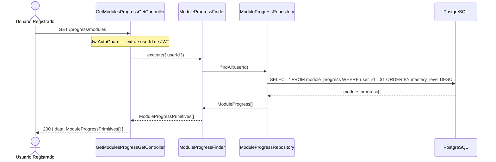

# Find Modules Progress — Diagrama de Secuencia

```mermaid
sequenceDiagram
    actor U as Usuario Registrado
    participant C as GetModulesProgressGetController
    participant UC as ModuleProgressFinder
    participant R as ModuleProgressRepository
    participant DB as PostgreSQL

    U->>C: GET /progress/modules
    note over C: JwtAuthGuard — extrae userId de JWT

    C->>UC: execute({ userId })

    UC->>R: findAll(userId)
    R->>DB: SELECT * FROM module_progress WHERE user_id = $1 ORDER BY mastery_level DESC
    DB-->>R: module_progress[]
    R-->>UC: ModuleProgress[]

    UC-->>C: ModuleProgressPrimitives[]
    C-->>U: 200 { data: ModuleProgressPrimitives[] }
```
