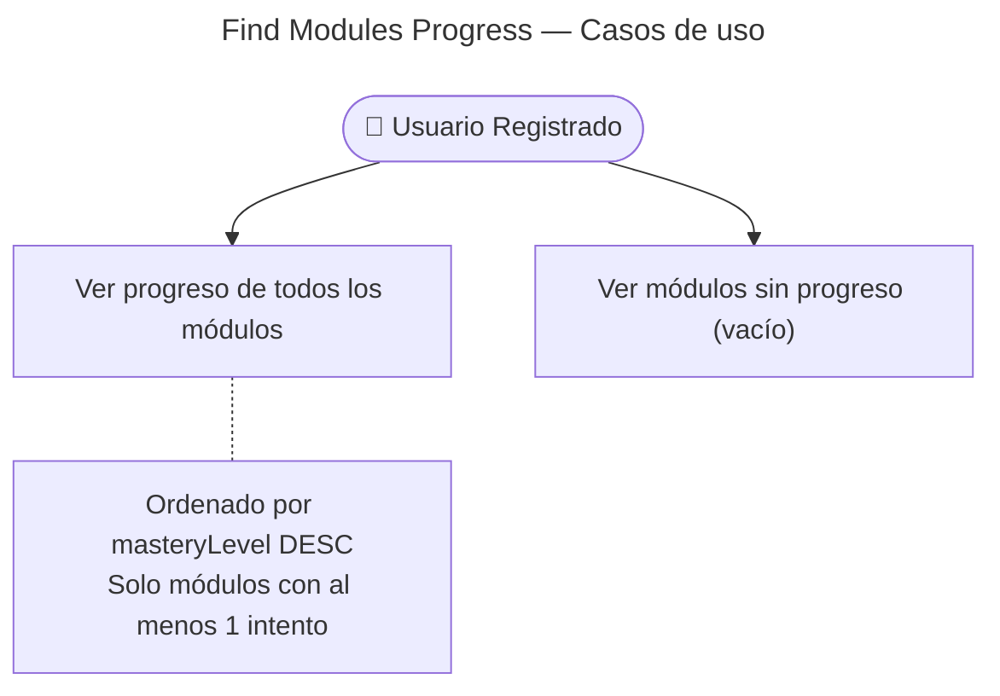

# Find Modules Progress — Casos de Uso

## Reglas de negocio

| Regla | Actor | Acción |
|---|---|---|
| Solo usuarios autenticados con JWT | User | `JwtAuthGuard` — 401 si no hay token |
| Devuelve lista vacía si no hay progreso | User | `[]` — no es un error |
| Ordenado por `masteryLevel` DESC | Sistema | Módulos más avanzados primero |
| Solo módulos en los que el usuario ha jugado aparecen | Sistema | No se pre-crea `ModuleProgress` — se crea al `GameCompleted` |
