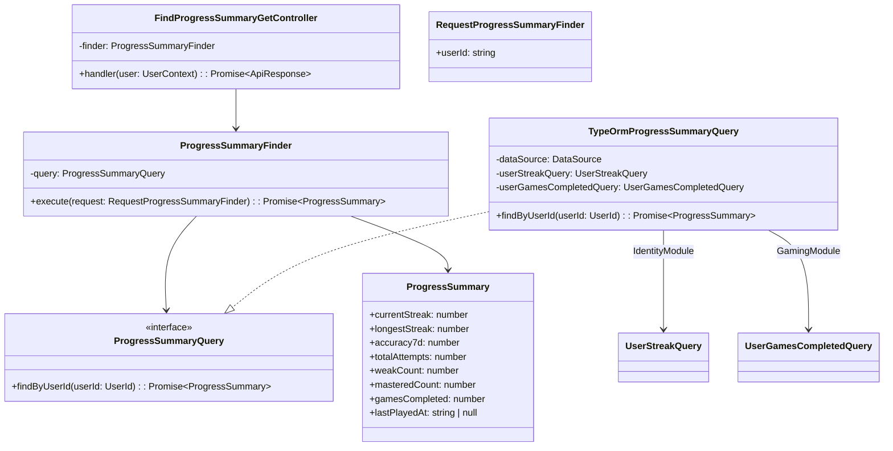

# Find Progress Summary — Diagrama de Clases

```mermaid
classDiagram
    class FindProgressSummaryGetController {
        -finder: ProgressSummaryFinder
        +handler(user: UserContext): Promise~ApiResponse~
    }

    class ProgressSummaryFinder {
        -query: ProgressSummaryQuery
        +execute(request: RequestProgressSummaryFinder): Promise~ProgressSummary~
    }

    class RequestProgressSummaryFinder {
        +userId: string
    }

    class ProgressSummary {
        +currentStreak: number
        +longestStreak: number
        +accuracy7d: number
        +totalAttempts: number
        +weakCount: number
        +masteredCount: number
        +gamesCompleted: number
        +lastPlayedAt: string | null
    }

    class ProgressSummaryQuery {
        <<interface>>
        +findByUserId(userId: UserId): Promise~ProgressSummary~
    }

    class TypeOrmProgressSummaryQuery {
        -dataSource: DataSource
        -userStreakQuery: UserStreakQuery
        -userGamesCompletedQuery: UserGamesCompletedQuery
        +findByUserId(userId: UserId): Promise~ProgressSummary~
    }

    FindProgressSummaryGetController --> ProgressSummaryFinder
    ProgressSummaryFinder --> ProgressSummaryQuery
    ProgressSummaryFinder --> ProgressSummary
    TypeOrmProgressSummaryQuery ..|> ProgressSummaryQuery
    TypeOrmProgressSummaryQuery --> UserStreakQuery : IdentityModule
    TypeOrmProgressSummaryQuery --> UserGamesCompletedQuery : GamingModule
```
