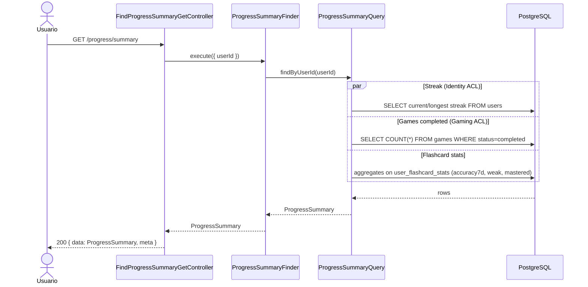

# Find Progress Summary — Diagrama de Secuencia

## Reglas

| Regla | Detalle |
|-------|---------|
| Auth | JWT obligatorio |
| `accuracy7d` | Intentos correctos / totales en ventana 7 días |
| `weakCount` | Flashcards con accuracy < 0.5 y al menos 1 intento |
| `masteredCount` | Flashcards con mastery ≥ 2 |
| Cross-BC | Streak vía `USER_STREAK_QUERY`; games vía `USER_GAMES_COMPLETED_QUERY` |
