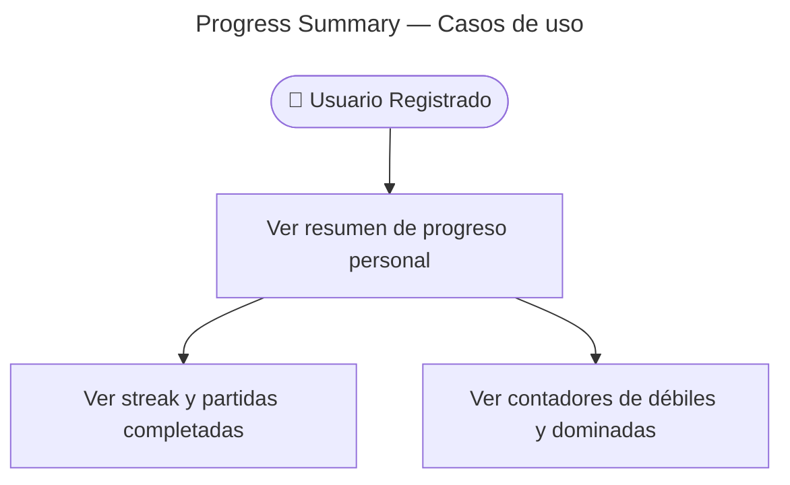

# Find Progress Summary — Casos de Uso

## Reglas de negocio

| Regla | Detalle |
|-------|---------|
| Auth | JWT obligatorio — 401 sin token |
| Agregación | Read model SQL en `TypeOrmProgressSummaryQuery` |
| Streak | Lee `users.current_streak` / `longest_streak` (Identity) |
| Games | Cuenta `games` completadas del usuario (Gaming) |
| Envelope | `{ data: ProgressSummary }` |

## ProgressSummary

| Campo | Tipo |
|-------|------|
| `currentStreak` | number |
| `longestStreak` | number |
| `accuracy7d` | number (0–1) |
| `totalAttempts` | number |
| `weakCount` | number |
| `masteredCount` | number |
| `gamesCompleted` | number |
| `lastPlayedAt` | ISO8601 \| null |
