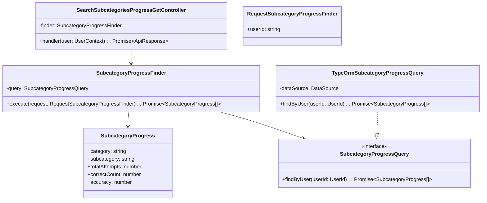

# Find Subcategories Progress — Diagrama de Clases

```mermaid
classDiagram
    class SearchSubcategoriesProgressGetController {
        -finder: SubcategoryProgressFinder
        +handler(user: UserContext): Promise~ApiResponse~
    }

    class SubcategoryProgressFinder {
        -query: SubcategoryProgressQuery
        +execute(request: RequestSubcategoryProgressFinder): Promise~SubcategoryProgress[]~
    }

    class RequestSubcategoryProgressFinder {
        +userId: string
    }

    class SubcategoryProgress {
        +category: string
        +subcategory: string
        +totalAttempts: number
        +correctCount: number
        +accuracy: number
    }

    class SubcategoryProgressQuery {
        <<interface>>
        +findByUser(userId: UserId): Promise~SubcategoryProgress[]~
    }

    class TypeOrmSubcategoryProgressQuery {
        -dataSource: DataSource
        +findByUser(userId: UserId): Promise~SubcategoryProgress[]~
    }

    SearchSubcategoriesProgressGetController --> SubcategoryProgressFinder
    SubcategoryProgressFinder --> SubcategoryProgressQuery
    SubcategoryProgressFinder --> SubcategoryProgress
    TypeOrmSubcategoryProgressQuery ..|> SubcategoryProgressQuery
```
