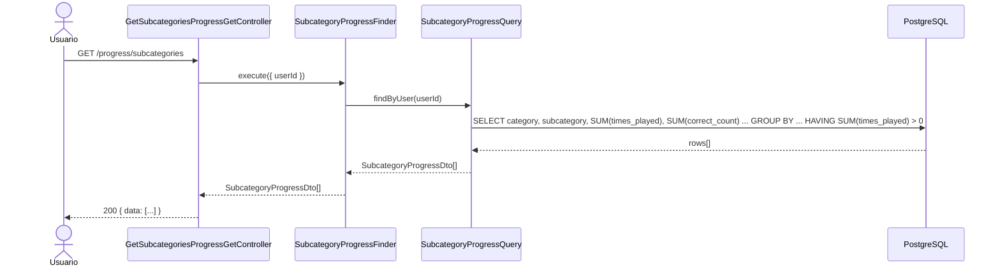

# Find Subcategories Progress — Diagrama de Secuencia

```mermaid
sequenceDiagram
    actor U as Usuario
    participant C as GetSubcategoriesProgressGetController
    participant UC as SubcategoryProgressFinder
    participant Q as SubcategoryProgressQuery
    participant DB as PostgreSQL

    U->>C: GET /progress/subcategories
    C->>UC: execute({ userId })
    UC->>Q: findByUser(userId)
    Q->>DB: SELECT category, subcategory, SUM(times_played), SUM(correct_count) ... GROUP BY ... HAVING SUM(times_played) > 0
    DB-->>Q: rows[]
    Q-->>UC: SubcategoryProgressDto[]
    UC-->>C: SubcategoryProgressDto[]
    C-->>U: 200 { data: [...] }
```
