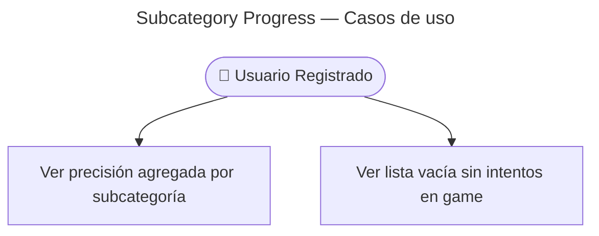

# Find Subcategories Progress — Casos de Uso

## Reglas de negocio

| Regla | Detalle |
|-------|---------|
| Auth | JWT obligatorio — 401 sin token |
| Agregación | `GROUP BY f.category, f.subcategory` desde `user_flashcard_stats` + join `flashcards` |
| Filtro | `HAVING SUM(times_played) > 0` — solo subcategorías con al menos un intento |
| Accuracy | `correctCount / totalAttempts` (0–1 en API) |
| Envelope | `{ data: SubcategoryProgressDto[] }` |

## SubcategoryProgressDto

| Campo | Tipo |
|-------|------|
| `category` | string |
| `subcategory` | string |
| `totalAttempts` | number |
| `correctCount` | number |
| `accuracy` | number (0–1) |
