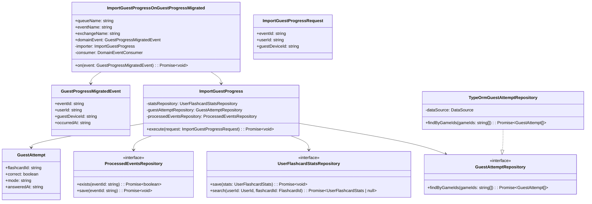

# Import Guest Progress — Diagrama de Clases

```mermaid
classDiagram
    class ImportGuestProgressOnGuestProgressMigrated {
        +queueName: string
        +eventName: string
        +exchangeName: string
        +domainEvent: GuestProgressMigratedEvent
        -importer: ImportGuestProgress
        -consumer: DomainEventConsumer
        +on(event: GuestProgressMigratedEvent): Promise~void~
    }

    class ImportGuestProgress {
        -statsRepository: UserFlashcardStatsRepository
        -guestAttemptRepository: GuestAttemptRepository
        -processedEventsRepository: ProcessedEventsRepository
        +execute(request: ImportGuestProgressRequest): Promise~void~
    }

    class ImportGuestProgressRequest {
        +eventId: string
        +userId: string
        +guestDeviceId: string
    }

    class GuestProgressMigratedEvent {
        +eventId: string
        +userId: string
        +guestDeviceId: string
        +occurredAt: string
    }

    class GuestAttempt {
        +flashcardId: string
        +correct: boolean
        +mode: string
        +answeredAt: string
    }

    class GuestAttemptRepository {
        <<interface>>
        +findByGameIds(gameIds: string[]): Promise~GuestAttempt[]~
    }

    class ProcessedEventsRepository {
        <<interface>>
        +exists(eventId: string): Promise~boolean~
        +save(eventId: string): Promise~void~
    }

    class UserFlashcardStatsRepository {
        <<interface>>
        +save(stats: UserFlashcardStats): Promise~void~
        +search(userId: UserId, flashcardId: FlashcardId): Promise~UserFlashcardStats | null~
    }

    class TypeOrmGuestAttemptRepository {
        -dataSource: DataSource
        +findByGameIds(gameIds: string[]): Promise~GuestAttempt[]~
    }

    ImportGuestProgressOnGuestProgressMigrated --> ImportGuestProgress
    ImportGuestProgressOnGuestProgressMigrated --> GuestProgressMigratedEvent
    ImportGuestProgress --> GuestAttemptRepository
    ImportGuestProgress --> UserFlashcardStatsRepository
    ImportGuestProgress --> ProcessedEventsRepository
    ImportGuestProgress --> GuestAttempt
    TypeOrmGuestAttemptRepository ..|> GuestAttemptRepository
```
