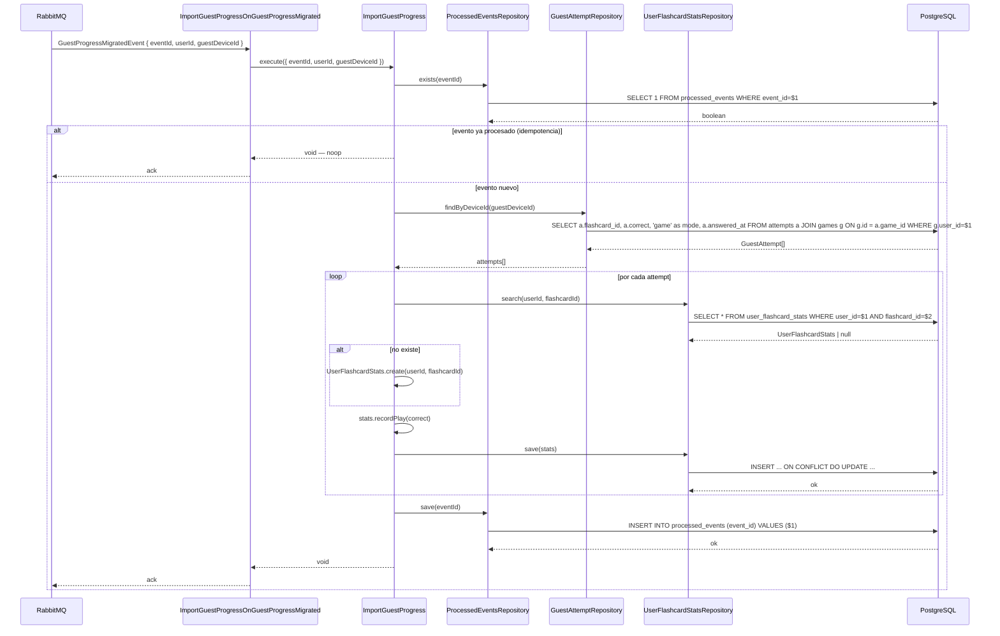

# Import Guest Progress — Diagrama de Secuencia

```mermaid
sequenceDiagram
    participant AMQP as RabbitMQ
    participant S as ImportGuestProgressOnGuestProgressMigrated
    participant UC as ImportGuestProgress
    participant PE as ProcessedEventsRepository
    participant GA as GuestAttemptRepository
    participant SR as UserFlashcardStatsRepository
    participant DB as PostgreSQL

    AMQP->>S: GuestProgressMigratedEvent { eventId, userId, guestDeviceId }

    S->>UC: execute({ eventId, userId, guestDeviceId })

    UC->>PE: exists(eventId)
    PE->>DB: SELECT 1 FROM processed_events WHERE event_id=$1
    DB-->>PE: boolean

    alt evento ya procesado (idempotencia)
        UC-->>S: void — noop
        S-->>AMQP: ack
    else evento nuevo
        UC->>GA: findByDeviceId(guestDeviceId)
        GA->>DB: SELECT a.flashcard_id, a.correct, 'game' as mode, a.answered_at FROM attempts a JOIN games g ON g.id = a.game_id WHERE g.user_id=$1
        DB-->>GA: GuestAttempt[]
        GA-->>UC: attempts[]

        loop por cada attempt
            UC->>SR: search(userId, flashcardId)
            SR->>DB: SELECT * FROM user_flashcard_stats WHERE user_id=$1 AND flashcard_id=$2
            DB-->>SR: UserFlashcardStats | null

            alt no existe
                UC->>UC: UserFlashcardStats.create(userId, flashcardId)
            end

            UC->>UC: stats.recordPlay(correct)
            UC->>SR: save(stats)
            SR->>DB: INSERT ... ON CONFLICT DO UPDATE ...
            DB-->>SR: ok
        end

        UC->>PE: save(eventId)
        PE->>DB: INSERT INTO processed_events (event_id) VALUES ($1)
        DB-->>PE: ok

        UC-->>S: void
        S-->>AMQP: ack
    end
```
