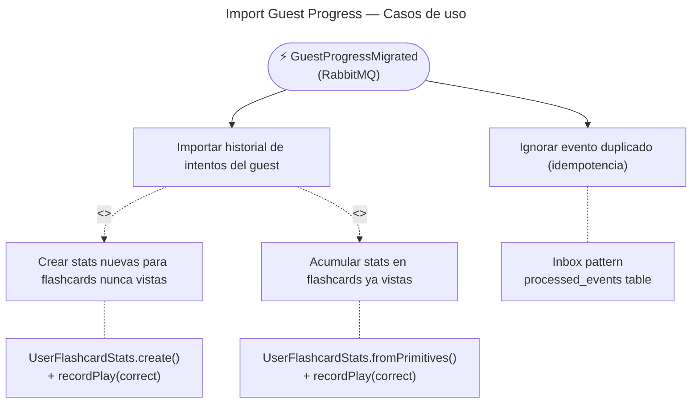

# Import Guest Progress — Casos de Uso

## Reglas de negocio

| Regla | Acción |
|---|---|
| **Idempotencia** — si el `eventId` ya fue procesado, se ignora | Inbox pattern via tabla `processed_events` |
| Los intentos del guest se leen de la tabla `attempts` JOIN `games` de Gaming | Raw SQL cross-BC — solo lectura, no acopla BCs |
| `TypeOrmGuestAttemptRepository` hardcodea `mode: 'game'` para todos los intentos guest | Los guests solo pueden jugar en modo `game` (no study) |
| Por cada intento: busca o crea `UserFlashcardStats` y llama `recordPlay(correct)` | Mismo flujo que `UpdateFlashcardStats`, pero en bulk |
| Al final del procesamiento, guarda el `eventId` en `processed_events` | Garantiza que si el mensaje se reintenta, no se duplican stats |
| **No** recalcula `ModuleProgress` — eso ocurre solo vía `GameCompleted` | Separación de responsabilidades — cada subscriber hace una cosa |
