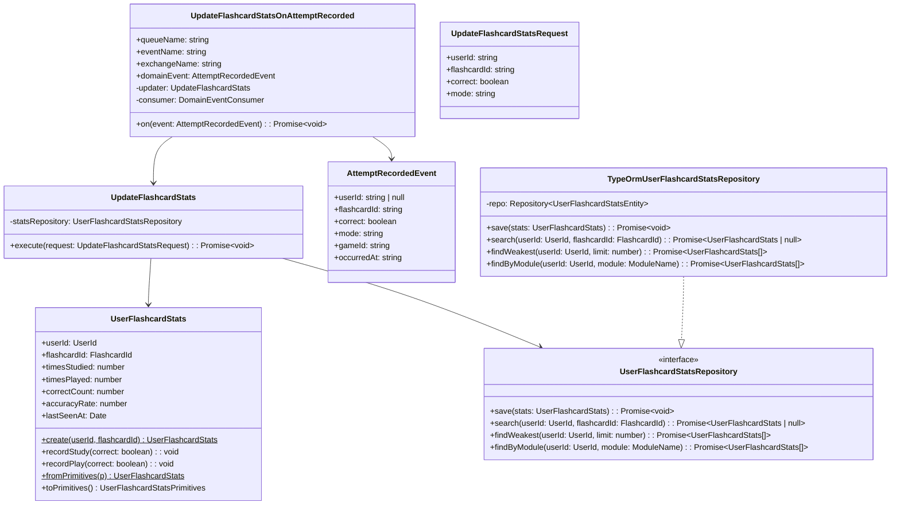

# Update Flashcard Stats — Diagrama de Clases

```mermaid
classDiagram
    class UpdateFlashcardStatsOnAttemptRecorded {
        +queueName: string
        +eventName: string
        +exchangeName: string
        +domainEvent: AttemptRecordedEvent
        -updater: UpdateFlashcardStats
        -consumer: DomainEventConsumer
        +on(event: AttemptRecordedEvent): Promise~void~
    }

    class UpdateFlashcardStats {
        -statsRepository: UserFlashcardStatsRepository
        +execute(request: UpdateFlashcardStatsRequest): Promise~void~
    }

    class UpdateFlashcardStatsRequest {
        +userId: string
        +flashcardId: string
        +correct: boolean
        +mode: string
    }

    class AttemptRecordedEvent {
        +userId: string | null
        +flashcardId: string
        +correct: boolean
        +mode: string
        +gameId: string
        +occurredAt: string
    }

    class UserFlashcardStats {
        +userId: UserId
        +flashcardId: FlashcardId
        +timesStudied: number
        +timesPlayed: number
        +correctCount: number
        +accuracyRate: number
        +lastSeenAt: Date
        +create(userId, flashcardId)$ UserFlashcardStats
        +recordStudy(correct: boolean): void
        +recordPlay(correct: boolean): void
        +fromPrimitives(p)$ UserFlashcardStats
        +toPrimitives() UserFlashcardStatsPrimitives
    }

    class UserFlashcardStatsRepository {
        <<interface>>
        +save(stats: UserFlashcardStats): Promise~void~
        +search(userId: UserId, flashcardId: FlashcardId): Promise~UserFlashcardStats | null~
        +findWeakest(userId: UserId, limit: number): Promise~UserFlashcardStats[]~
        +findByModule(userId: UserId, module: ModuleName): Promise~UserFlashcardStats[]~
    }

    class TypeOrmUserFlashcardStatsRepository {
        -repo: Repository~UserFlashcardStatsEntity~
        +save(stats: UserFlashcardStats): Promise~void~
        +search(userId: UserId, flashcardId: FlashcardId): Promise~UserFlashcardStats | null~
        +findWeakest(userId: UserId, limit: number): Promise~UserFlashcardStats[]~
        +findByModule(userId: UserId, module: ModuleName): Promise~UserFlashcardStats[]~
    }

    UpdateFlashcardStatsOnAttemptRecorded --> UpdateFlashcardStats
    UpdateFlashcardStatsOnAttemptRecorded --> AttemptRecordedEvent
    UpdateFlashcardStats --> UserFlashcardStats
    UpdateFlashcardStats --> UserFlashcardStatsRepository
    TypeOrmUserFlashcardStatsRepository ..|> UserFlashcardStatsRepository
```
