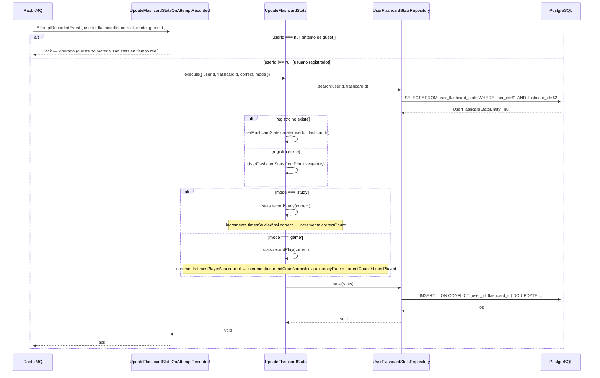

# Update Flashcard Stats — Diagrama de Secuencia

```mermaid
sequenceDiagram
    participant AMQP as RabbitMQ
    participant S as UpdateFlashcardStatsOnAttemptRecorded
    participant UC as UpdateFlashcardStats
    participant R as UserFlashcardStatsRepository
    participant DB as PostgreSQL

    AMQP->>S: AttemptRecordedEvent { userId, flashcardId, correct, mode, gameId }

    alt userId === null (intento de guest)
        S-->>AMQP: ack — ignorado (guests no materializan stats en tiempo real)
    else userId !== null (usuario registrado)
        S->>UC: execute({ userId, flashcardId, correct, mode })

        UC->>R: search(userId, flashcardId)
        R->>DB: SELECT * FROM user_flashcard_stats WHERE user_id=$1 AND flashcard_id=$2
        DB-->>R: UserFlashcardStatsEntity | null

        alt registro no existe
            UC->>UC: UserFlashcardStats.create(userId, flashcardId)
        else registro existe
            UC->>UC: UserFlashcardStats.fromPrimitives(entity)
        end

        alt mode === 'study'
            UC->>UC: stats.recordStudy(correct)
            note over UC: incrementa timesStudied\nsi correct → incrementa correctCount
        else mode === 'game'
            UC->>UC: stats.recordPlay(correct)
            note over UC: incrementa timesPlayed\nsi correct → incrementa correctCount\nrecalcula accuracyRate = correctCount / timesPlayed
        end

        UC->>R: save(stats)
        R->>DB: INSERT ... ON CONFLICT (user_id, flashcard_id) DO UPDATE ...
        DB-->>R: ok
        R-->>UC: void

        UC-->>S: void
        S-->>AMQP: ack
    end
```
