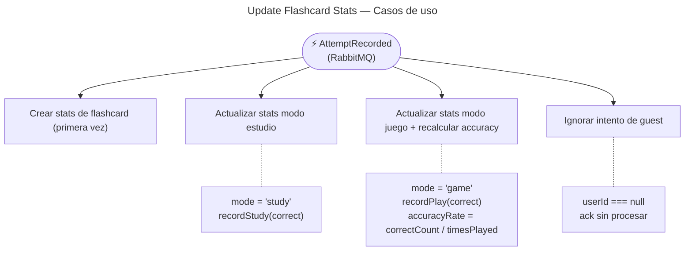

# Update Flashcard Stats — Casos de Uso

## Reglas de negocio

| Regla | Acción |
|---|---|
| Si `userId === null`, el evento se ignora (guest) | `ack` sin procesar — los guests importan su progreso al registrarse |
| Si el registro no existe, se crea con contadores en 0 | `UserFlashcardStats.create()` → `recordStudy/Play()` → `save()` |
| `timesStudied` y `correctCount (study)` se actualizan con `mode = 'study'` | `recordStudy(correct)` |
| `timesPlayed`, `correctCount` y `accuracyRate` se actualizan con `mode = 'game'` | `recordPlay(correct)` |
| `accuracyRate = correctCount / timesPlayed` — solo intentos en modo `game` | Calculado en `recordPlay()`, nunca en `recordStudy()` |
