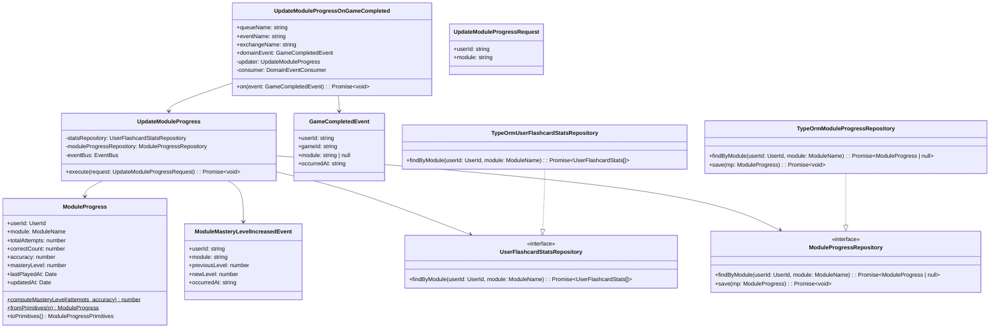

# Update Module Progress — Diagrama de Clases

```mermaid
classDiagram
    class UpdateModuleProgressOnGameCompleted {
        +queueName: string
        +eventName: string
        +exchangeName: string
        +domainEvent: GameCompletedEvent
        -updater: UpdateModuleProgress
        -consumer: DomainEventConsumer
        +on(event: GameCompletedEvent): Promise~void~
    }

    class UpdateModuleProgress {
        -statsRepository: UserFlashcardStatsRepository
        -moduleProgressRepository: ModuleProgressRepository
        -eventBus: EventBus
        +execute(request: UpdateModuleProgressRequest): Promise~void~
    }

    class UpdateModuleProgressRequest {
        +userId: string
        +module: string
    }

    class GameCompletedEvent {
        +userId: string
        +gameId: string
        +module: string | null
        +occurredAt: string
    }

    class ModuleProgress {
        +userId: UserId
        +module: ModuleName
        +totalAttempts: number
        +correctCount: number
        +accuracy: number
        +masteryLevel: number
        +lastPlayedAt: Date
        +updatedAt: Date
        +computeMasteryLevel(attempts, accuracy)$ number
        +fromPrimitives(p)$ ModuleProgress
        +toPrimitives() ModuleProgressPrimitives
    }

    class ModuleMasteryLevelIncreasedEvent {
        +userId: string
        +module: string
        +previousLevel: number
        +newLevel: number
        +occurredAt: string
    }

    class UserFlashcardStatsRepository {
        <<interface>>
        +findByModule(userId: UserId, module: ModuleName): Promise~UserFlashcardStats[]~
    }

    class ModuleProgressRepository {
        <<interface>>
        +findByModule(userId: UserId, module: ModuleName): Promise~ModuleProgress | null~
        +save(mp: ModuleProgress): Promise~void~
    }

    class TypeOrmUserFlashcardStatsRepository {
        +findByModule(userId: UserId, module: ModuleName): Promise~UserFlashcardStats[]~
    }

    class TypeOrmModuleProgressRepository {
        +findByModule(userId: UserId, module: ModuleName): Promise~ModuleProgress | null~
        +save(mp: ModuleProgress): Promise~void~
    }

    UpdateModuleProgressOnGameCompleted --> UpdateModuleProgress
    UpdateModuleProgressOnGameCompleted --> GameCompletedEvent
    UpdateModuleProgress --> ModuleProgress
    UpdateModuleProgress --> ModuleMasteryLevelIncreasedEvent
    UpdateModuleProgress --> UserFlashcardStatsRepository
    UpdateModuleProgress --> ModuleProgressRepository
    TypeOrmUserFlashcardStatsRepository ..|> UserFlashcardStatsRepository
    TypeOrmModuleProgressRepository ..|> ModuleProgressRepository
```
