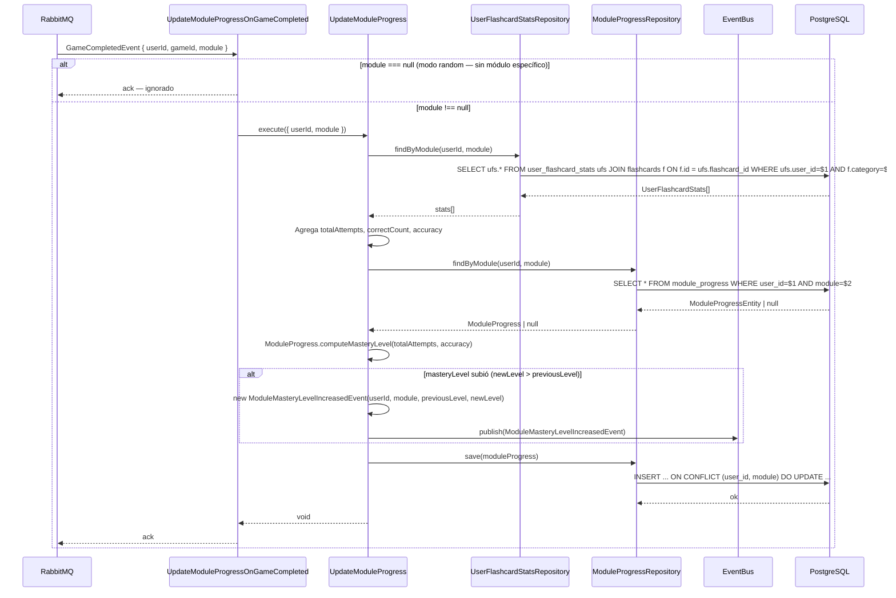

# Update Module Progress — Diagrama de Secuencia

```mermaid
sequenceDiagram
    participant AMQP as RabbitMQ
    participant S as UpdateModuleProgressOnGameCompleted
    participant UC as UpdateModuleProgress
    participant SR as UserFlashcardStatsRepository
    participant MR as ModuleProgressRepository
    participant EB as EventBus
    participant DB as PostgreSQL

    AMQP->>S: GameCompletedEvent { userId, gameId, module }

    alt module === null (modo random — sin módulo específico)
        S-->>AMQP: ack — ignorado
    else module !== null
        S->>UC: execute({ userId, module })

        UC->>SR: findByModule(userId, module)
        SR->>DB: SELECT ufs.* FROM user_flashcard_stats ufs JOIN flashcards f ON f.id = ufs.flashcard_id WHERE ufs.user_id=$1 AND f.category=$2
        DB-->>SR: UserFlashcardStats[]
        SR-->>UC: stats[]

        UC->>UC: Agrega totalAttempts, correctCount, accuracy

        UC->>MR: findByModule(userId, module)
        MR->>DB: SELECT * FROM module_progress WHERE user_id=$1 AND module=$2
        DB-->>MR: ModuleProgressEntity | null
        MR-->>UC: ModuleProgress | null

        UC->>UC: ModuleProgress.computeMasteryLevel(totalAttempts, accuracy)

        alt masteryLevel subió (newLevel > previousLevel)
            UC->>UC: new ModuleMasteryLevelIncreasedEvent(userId, module, previousLevel, newLevel)
            UC->>EB: publish(ModuleMasteryLevelIncreasedEvent)
        end

        UC->>MR: save(moduleProgress)
        MR->>DB: INSERT ... ON CONFLICT (user_id, module) DO UPDATE ...
        DB-->>MR: ok

        UC-->>S: void
        S-->>AMQP: ack
    end
```
