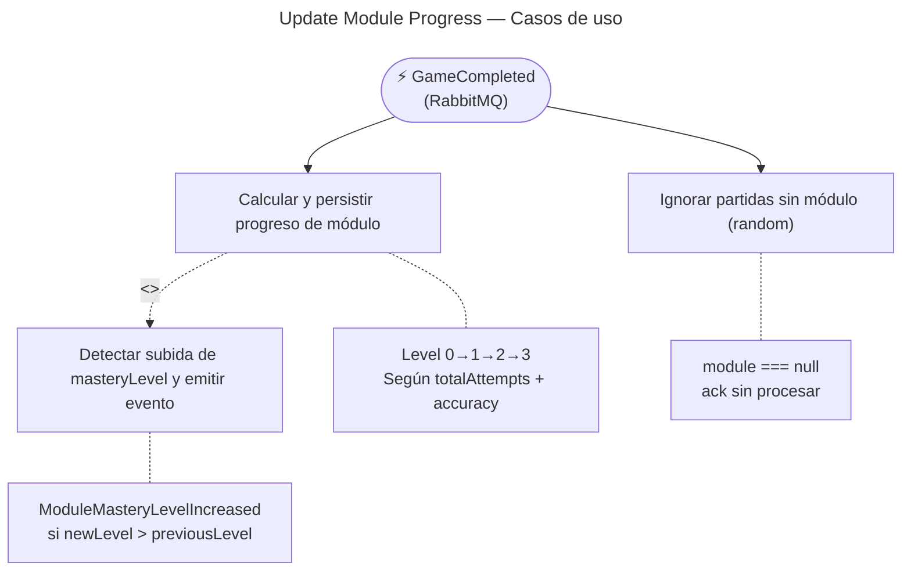

# Update Module Progress — Casos de Uso

## Reglas de negocio

| Regla | Acción |
|---|---|
| Si `module === null` (modo random), el evento se ignora | `ack` sin procesar |
| `totalAttempts` y `correctCount` se agregan desde `user_flashcard_stats` JOIN `flashcards.category` | Raw SQL cross-BC (solo lectura) |
| `masteryLevel` se calcula con `computeMasteryLevel(totalAttempts, accuracy)` | Level 0–3 según umbrales de intentos + accuracy |
| Si `newLevel > previousLevel`, se emite `ModuleMasteryLevelIncreasedEvent` | Solo si había progreso previo (`previousLevel !== null`) |
| `ModuleProgress` se persiste como upsert | `ON CONFLICT (user_id, module) DO UPDATE` |

## Umbrales de masteryLevel

| Level | totalAttempts | accuracy |
|---|---|---|
| 3 | ≥ 20 | ≥ 0.85 |
| 2 | ≥ 10 | ≥ 0.70 |
| 1 | ≥ 5  | ≥ 0.50 |
| 0 | — | — |
