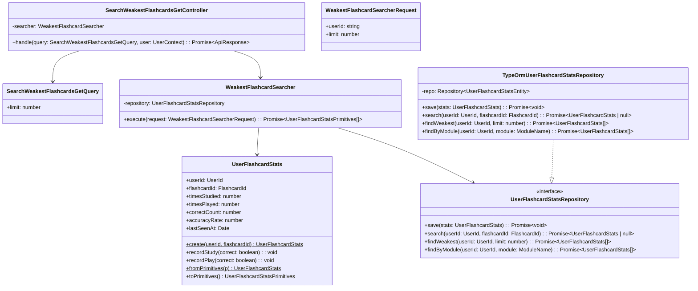

# Weakest Flashcards — Diagrama de Clases

```mermaid
classDiagram
    class SearchWeakestFlashcardsGetController {
        -searcher: WeakestFlashcardSearcher
        +handle(query: SearchWeakestFlashcardsGetQuery, user: UserContext): Promise~ApiResponse~
    }

    class SearchWeakestFlashcardsGetQuery {
        +limit: number
    }

    class WeakestFlashcardSearcher {
        -repository: UserFlashcardStatsRepository
        +execute(request: WeakestFlashcardSearcherRequest): Promise~UserFlashcardStatsPrimitives[]~
    }

    class WeakestFlashcardSearcherRequest {
        +userId: string
        +limit: number
    }

    class UserFlashcardStats {
        +userId: UserId
        +flashcardId: FlashcardId
        +timesStudied: number
        +timesPlayed: number
        +correctCount: number
        +accuracyRate: number
        +lastSeenAt: Date
        +create(userId, flashcardId)$ UserFlashcardStats
        +recordStudy(correct: boolean): void
        +recordPlay(correct: boolean): void
        +fromPrimitives(p)$ UserFlashcardStats
        +toPrimitives() UserFlashcardStatsPrimitives
    }

    class UserFlashcardStatsRepository {
        <<interface>>
        +save(stats: UserFlashcardStats): Promise~void~
        +search(userId: UserId, flashcardId: FlashcardId): Promise~UserFlashcardStats | null~
        +findWeakest(userId: UserId, limit: number): Promise~UserFlashcardStats[]~
        +findByModule(userId: UserId, module: ModuleName): Promise~UserFlashcardStats[]~
    }

    class TypeOrmUserFlashcardStatsRepository {
        -repo: Repository~UserFlashcardStatsEntity~
        +save(stats: UserFlashcardStats): Promise~void~
        +search(userId: UserId, flashcardId: FlashcardId): Promise~UserFlashcardStats | null~
        +findWeakest(userId: UserId, limit: number): Promise~UserFlashcardStats[]~
        +findByModule(userId: UserId, module: ModuleName): Promise~UserFlashcardStats[]~
    }

    SearchWeakestFlashcardsGetController --> WeakestFlashcardSearcher
    SearchWeakestFlashcardsGetController --> SearchWeakestFlashcardsGetQuery
    WeakestFlashcardSearcher --> UserFlashcardStatsRepository
    WeakestFlashcardSearcher --> UserFlashcardStats
    TypeOrmUserFlashcardStatsRepository ..|> UserFlashcardStatsRepository
```
