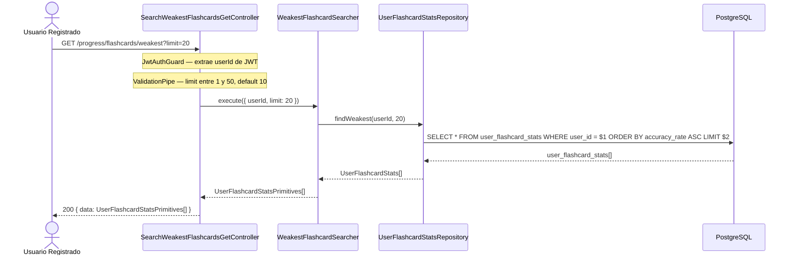

# Weakest Flashcards — Diagrama de Secuencia

```mermaid
sequenceDiagram
    actor U as Usuario Registrado
    participant C as SearchWeakestFlashcardsGetController
    participant UC as WeakestFlashcardSearcher
    participant R as UserFlashcardStatsRepository
    participant DB as PostgreSQL

    U->>C: GET /progress/flashcards/weakest?limit=20
    note over C: JwtAuthGuard — extrae userId de JWT
    note over C: ValidationPipe — limit entre 1 y 50, default 10

    C->>UC: execute({ userId, limit: 20 })

    UC->>R: findWeakest(userId, 20)
    R->>DB: SELECT * FROM user_flashcard_stats WHERE user_id = $1 ORDER BY accuracy_rate ASC LIMIT $2
    DB-->>R: user_flashcard_stats[]
    R-->>UC: UserFlashcardStats[]

    UC-->>C: UserFlashcardStatsPrimitives[]
    C-->>U: 200 { data: UserFlashcardStatsPrimitives[] }
```
