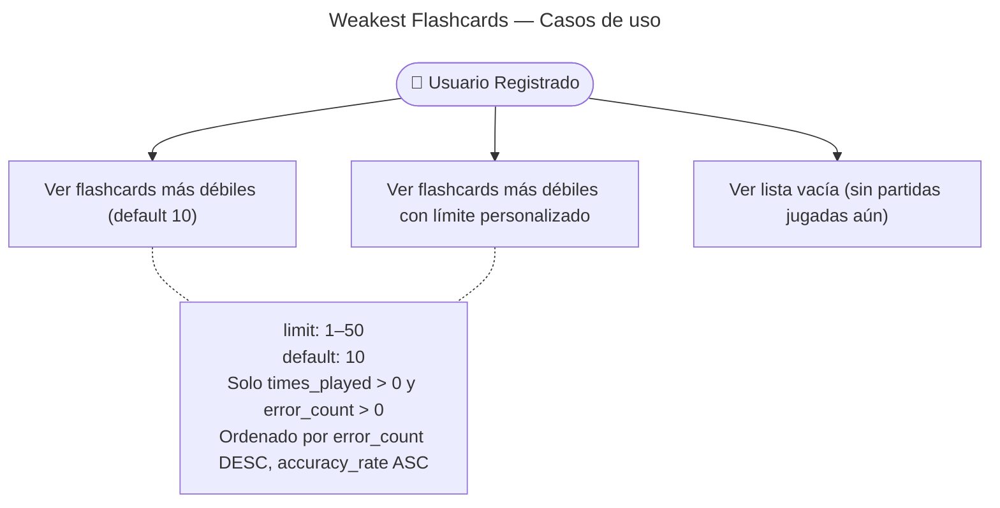

# Weakest Flashcards — Casos de Uso

## Reglas de negocio

| Regla | Actor | Acción |
|---|---|---|
| Solo usuarios autenticados con JWT | User | `JwtAuthGuard` — 401 si no hay token |
| `limit` entre 1 y 50, default 10 | Sistema | `ValidationPipe` — 400 si fuera de rango |
| Ordenado por error_count DESC, accuracy_rate ASC | Sistema | Solo cartas con `times_played > 0` y `error_count > 0` (`times_played - correct_count`); las más falladas primero |
| DTO incluye `category` y `subcategory` | Sistema | Labels resueltos en client vía catálogo |
| `accuracyRate` solo refleja intentos en modo `game` | Sistema | `recordPlay()` — el modo `study` actualiza `timesStudied` pero no `accuracyRate` |
| Lista vacía si el usuario no ha jugado ninguna partida | User | `[]` — no es un error |
