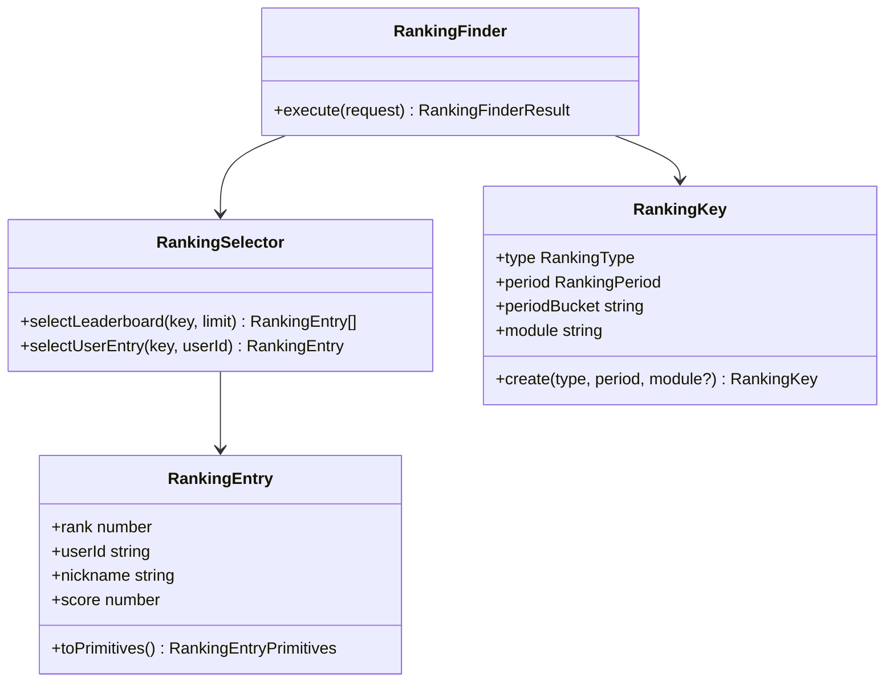

# Find Rankings — Clases

`RankingFinder` no usa el repository en el path de lectura — las queries con `RANK()` viven en `RankingSelector` (patrón selector, igual que `FlashcardSelector` en Gaming).
