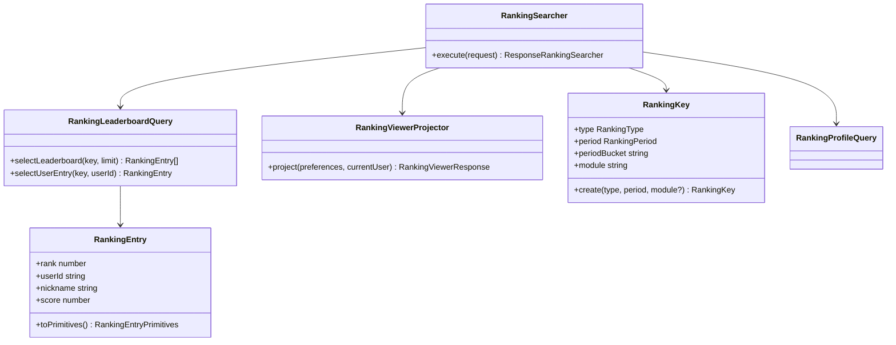

# Find Rankings — Clases

```mermaid
classDiagram
    class RankingSearcher {
        +execute(request) ResponseRankingSearcher
    }
    class RankingLeaderboardQuery {
        +selectLeaderboard(key, limit) RankingEntry[]
        +selectUserEntry(key, userId) RankingEntry
    }
    class RankingViewerProjector {
        +project(preferences, currentUser) RankingViewerResponse
    }
    class RankingKey {
        +type RankingType
        +period RankingPeriod
        +periodBucket string
        +module string
        +create(type, period, module?) RankingKey
    }
    class RankingEntry {
        +rank number
        +userId string
        +nickname string
        +score number
        +toPrimitives() RankingEntryPrimitives
    }
    RankingSearcher --> RankingLeaderboardQuery
    RankingSearcher --> RankingProfileQuery
    RankingSearcher --> RankingViewerProjector
    RankingSearcher --> RankingKey
    RankingLeaderboardQuery --> RankingEntry
```

`RankingSearcher` no usa el repository en el path de lectura — las queries con `RANK()` viven en `RankingLeaderboardQuery`.
