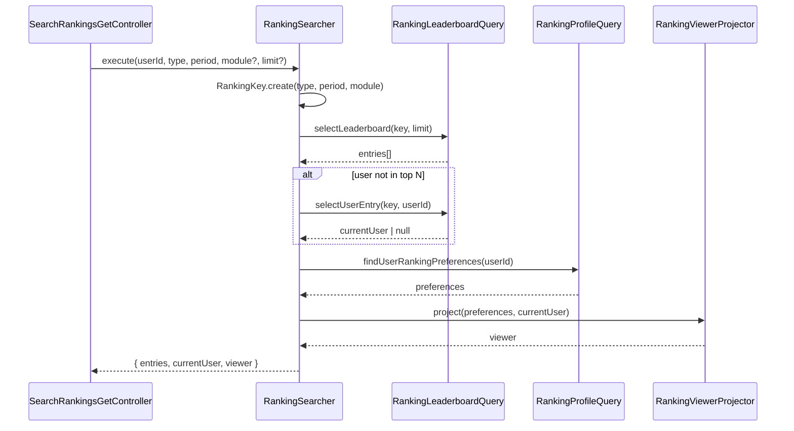

# Find Rankings — Secuencia

```mermaid
sequenceDiagram
    participant C as SearchRankingsGetController
    participant S as RankingSearcher
    participant Q as RankingLeaderboardQuery
    participant P as RankingProfileQuery
    participant V as RankingViewerProjector

    C->>S: execute(userId, type, period, module?, limit?)
    S->>S: RankingKey.create(type, period, module)
    S->>Q: selectLeaderboard(key, limit)
    Q-->>S: entries[]
    alt user not in top N
        S->>Q: selectUserEntry(key, userId)
        Q-->>S: currentUser | null
    end
    S->>P: findUserRankingPreferences(userId)
    P-->>S: preferences
    S->>V: project(preferences, currentUser)
    V-->>S: viewer
    S-->>C: { entries, currentUser, viewer }
```
