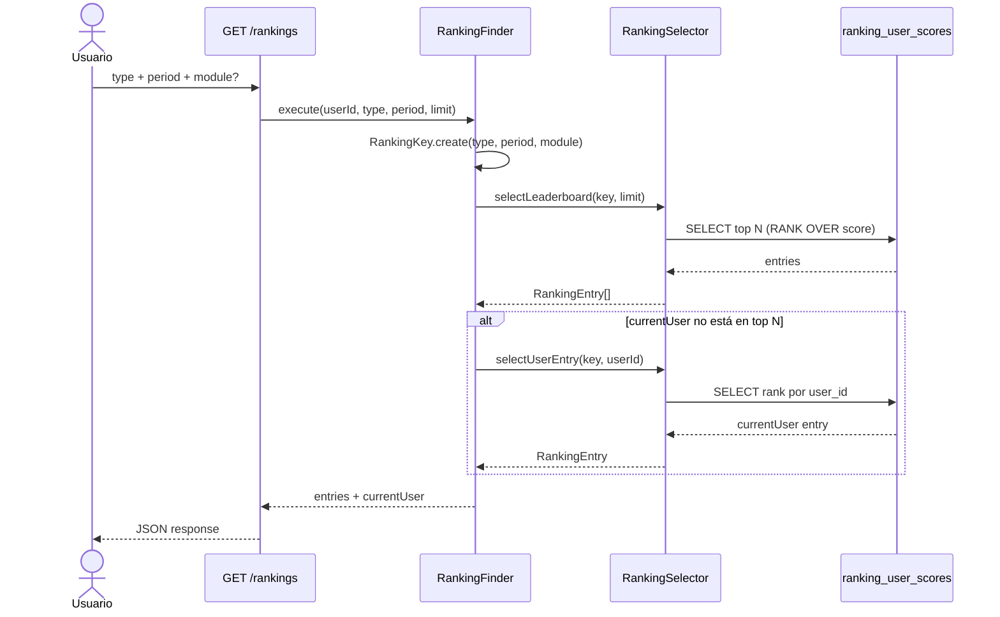

# Find Rankings — Secuencia

```mermaid
sequenceDiagram
    actor U as Usuario
    participant API as GET /rankings
    participant Finder as RankingFinder
    participant Sel as RankingSelector
    participant DB as ranking_user_scores

    U->>API: type + period + module?
    API->>Finder: execute(userId, type, period, limit)
    Finder->>Finder: RankingKey.create(type, period, module)
    Finder->>Sel: selectLeaderboard(key, limit)
    Sel->>DB: SELECT top N (RANK OVER score)
    DB-->>Sel: entries
    Sel-->>Finder: RankingEntry[]
    alt currentUser no está en top N
        Finder->>Sel: selectUserEntry(key, userId)
        Sel->>DB: SELECT rank por user_id
        DB-->>Sel: currentUser entry
        Sel-->>Finder: RankingEntry
    end
    Finder-->>API: entries + currentUser
    API-->>U: JSON response
```

No hay recomputo ni job programado en el path de lectura.
