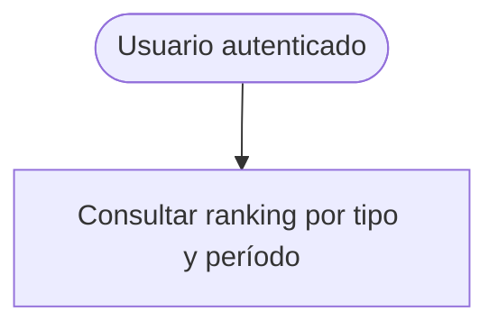

# Find Rankings — Casos de Uso

| Regla | Descripción |
| ----- | ----------- |
| Opt-in | Solo usuarios con filas en `ranking_user_scores` (`show_in_ranking = true` al escribir) |
| Lectura directa | `RankingSelector` sobre `ranking_user_scores` — sin recomputo |
| `module_master` | Requiere query param `module` |
| Posición fuera del top N | `currentUser` resuelto con `RankingSelector.selectUserEntry` |
| `best_streak` / `module_master` | Período efectivo siempre `all_time` |
