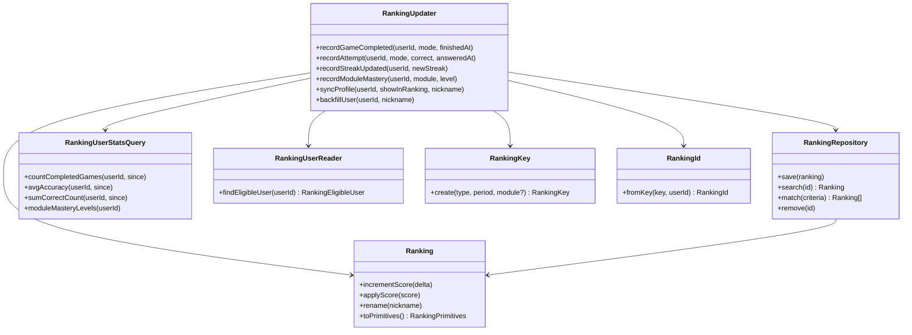

# Update Ranking — Clases

El repository expone solo los cuatro métodos estándar del dominio. Las queries cross-BC para recalcular scores viven en `RankingUserStatsQuery` — puerto separado, no métodos ad-hoc en el repository.
