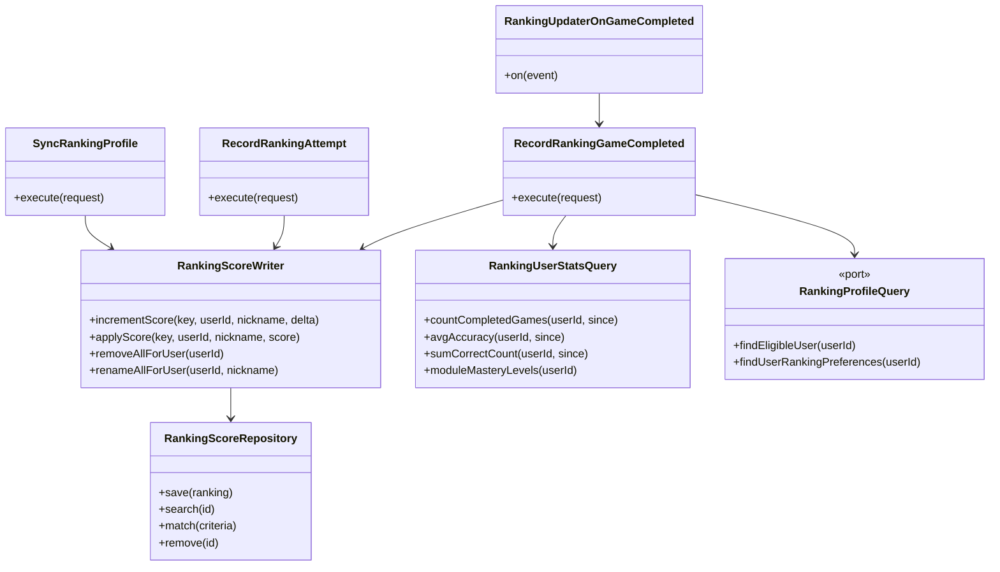

# Update Ranking — Clases

Subscribers en `projection/application/update/` delegan a use cases con `execute()`.

ACL: `IdentityRankingProfileAdapter` (search) implementa `RankingProfileQuery` vía `RankingEligibilityQuery` de Identity.
