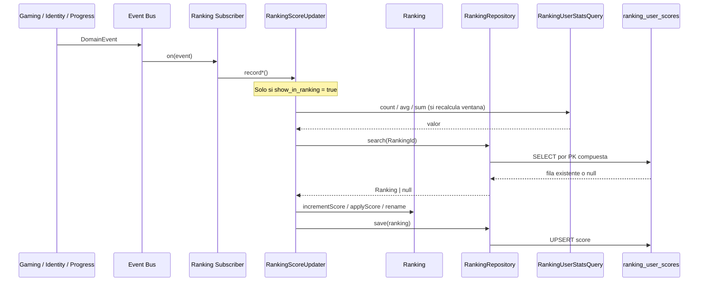

# Update Ranking — Secuencia

Handlers que mantienen `ranking_user_scores` en write-time a través del aggregate `Ranking`.

## Por evento

| Evento | Método updater | Tipos afectados | Periodos |
| ------ | -------------- | --------------- | -------- |
| `GameCompleted` (`mode = game`) | `RecordRankingGameCompleted` | `most_active` | `all_time` (+1 directo) + `weekly` / `monthly` (recalculados vía `countCompletedGames`) |
| `AttemptRecorded` (`mode = game`) | `RecordRankingAttempt` | `top_scorer`, `most_accurate` | `weekly` / `monthly` / `all_time` (recalculados vía `sumCorrectCount` / `avgAccuracy`) |
| `StreakUpdated` | `RecordRankingStreakUpdated` | `best_streak` | `all_time` |
| `ModuleMasteryLevelIncreased` | `RecordRankingModuleMastery` | `module_master` | `all_time` (por módulo) |
| `RankingProfileUpdated` | `SyncRankingProfile` | Todas las filas del usuario | `match(userId)` + `remove` (opt-out) o `renameAllForUser` + backfill (opt-in) |

## syncProfile

| Acción | Flujo |
| ------ | ----- |
| Opt-out (`show_in_ranking = false`) | `repository.match(userId)` → `repository.remove` por cada fila |
| Opt-in | `rename` en filas existentes + `backfillUser` recalcula histórico vía `RankingUserStatsQuery` |
