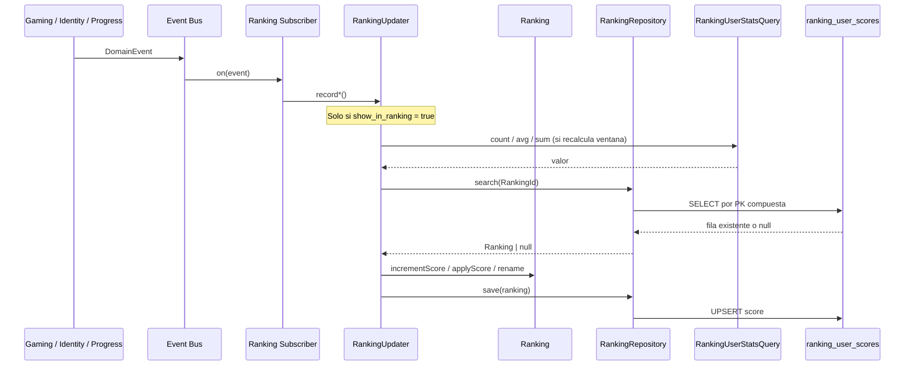

# Update Ranking — Secuencia

Handlers que mantienen `ranking_user_scores` en write-time a través del aggregate `Ranking`.

## Por evento

| Evento | Método updater | Tipos afectados |
| ------ | -------------- | --------------- |
| `GameCompleted` | `recordGameCompleted` | `most_active` |
| `AttemptRecorded` | `recordAttempt` | `most_accurate`, `top_scorer` |
| `StreakUpdated` | `recordStreakUpdated` | `best_streak` |
| `ModuleMasteryLevelIncreased` | `recordModuleMastery` | `module_master` |
| `PATCH ranking-profile` | `syncProfile` | Todas las filas del usuario (`match` + `remove` o backfill) |

## syncProfile

| Acción | Flujo |
| ------ | ----- |
| Opt-out (`show_in_ranking = false`) | `repository.match(userId)` → `repository.remove` por cada fila |
| Opt-in | `rename` en filas existentes + `backfillUser` recalcula histórico vía `RankingUserStatsQuery` |
