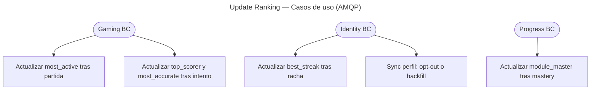

# Update Ranking — Casos de Uso

## Use cases (`projection/application/update/`)

| Use case | Evento / trigger | Tipos ranking |
|----------|------------------|---------------|
| `RecordRankingGameCompleted` | `GameCompleted` | `most_active` (daily/weekly/monthly) |
| `RecordRankingAttempt` | `AttemptRecorded` | `top_scorer`, `most_accurate` |
| `RecordRankingStreakUpdated` | `StreakUpdated` | `best_streak` |
| `RecordRankingModuleMastery` | `ModuleMasteryLevelIncreased` | `module_master` |
| `SyncRankingProfile` | `RankingProfileUpdated` | Todas las filas del usuario |

## Reglas de negocio

| Regla | Detalle |
|-------|---------|
| Eligibility | Solo usuarios con `show_in_ranking = true` (ACL Identity) |
| Write-time | Scores persistidos en `ranking_user_scores` — lectura sin recomputo |
| `top_scorer` | `sumCorrectCount` en ventana del periodo (paridad con backfill) |
| Opt-out | `SyncRankingProfile` → `removeAllForUser` |
| Opt-in | `renameAllForUser` + backfill histórico vía `RankingUserStatsQuery` |
| Idempotencia | Inbox `processed_events` en subscribers |

## Subscribers

| Handler | Cola |
|---------|------|
| `RankingUpdaterOnGameCompleted` | `ranking.update_ranking_on_game_completed` |
| `RankingUpdaterOnAttemptRecorded` | `ranking.update_ranking_on_attempt_recorded` |
| `RankingUpdaterOnStreakUpdated` | `ranking.update_ranking_on_streak_updated` |
| `RankingUpdaterOnModuleMasteryLevelIncreased` | `ranking.update_ranking_on_module_mastery_level_increased` |
| `RankingUpdaterOnRankingProfileUpdated` | `ranking.update_ranking_on_ranking_profile_updated` |
