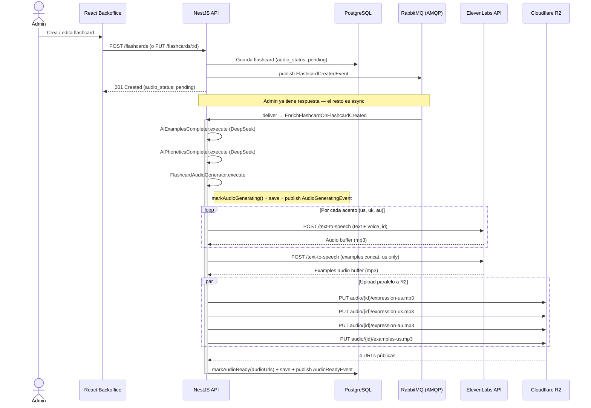

# Audio Generation Pipeline

Event-driven AMQP pipeline. No Bull queue. Admin returns immediately while subscribers process asynchronously.

## Notas

- **NO hay Bull queue.** La generación es AMQP-driven — el aggregate publica `FlashcardCreatedEvent`, `AmqpMessageBus` lo enruta a `enrich_flashcard_on_flashcard_created` queue.
- **Admin recibe respuesta inmediata.** El POST /flashcards solo persiste + publica el evento. El enrichment (ejemplos + fonética + audio) corre async en `EnrichFlashcardOnFlashcardCreated` (ver `apps/api/src/content/flashcard/application/enrich/enrich-flashcard-on-flashcard-created.ts`).
- **4 llamadas a ElevenLabs por flashcard** — 3 acentos de expression (`us`, `uk`, `au`) + 1 audio concatenado de examples (solo `us`). Ver `FlashcardAudioGenerator.execute()` líneas 60–114.
- **Audio nunca toca la VPS en prod.** ElevenLabs devuelve el buffer mp3, se sube directamente a Cloudflare R2 vía `R2AudioStorage.upload()` con `Promise.all` para paralelizar.
- **Backoffice muestra estado por flashcard** — `pending | generating | ready | failed`. El backoffice puede pollear `GET /flashcards/:id` o subscribirse al backchannel si lo implementa.
- **Retry policy de AMQP** — backoff exponencial 1s → 5s → 10s antes de DLQ (`AmqpMessageBus` con `.retry` + `.dead_letter` queues, ver skill `api-events-infra`).

## Alternatives considered

- **Bull queue (Redis)**: se descartó para el TFM. Cubriría el mismo caso de uso (job async con retry) pero introduce Redis como dependencia adicional de infra. Los subscribers AMQP ya nos dan retry, DLQ e idempotencia via `processed_events` (inbox pattern), sin tocar Redis. Decisión documentada en `docs/adr/019-event-bus-strategy.md`.
- **In-process worker (setImmediate / Promise.resolve().then)**: descartado por acoplamiento. Un crash del proceso pierde los jobs en vuelo. AMQP sobrevive a reinicios.

## Source files verified

- `apps/api/src/content/flashcard/application/generate-audio/flashcard-audio-generator.ts:60-114`
- `apps/api/src/content/flashcard/application/enrich/enrich-flashcard-on-flashcard-created.ts:14-37`
- `apps/api/src/content/flashcard/application/complete-examples/ai-examples-completer.ts`
- `apps/api/src/content/flashcard/application/complete-phonetics/ai-phonetics-completer.ts`
- `apps/api/src/content/flashcard/infrastructure/persistence/flashcard.entity.ts`
- `apps/api/src/shared/infrastructure/amqp-message-bus/` (AmqpMessageBus implementation)
- `docs/adr/019-event-bus-strategy.md`