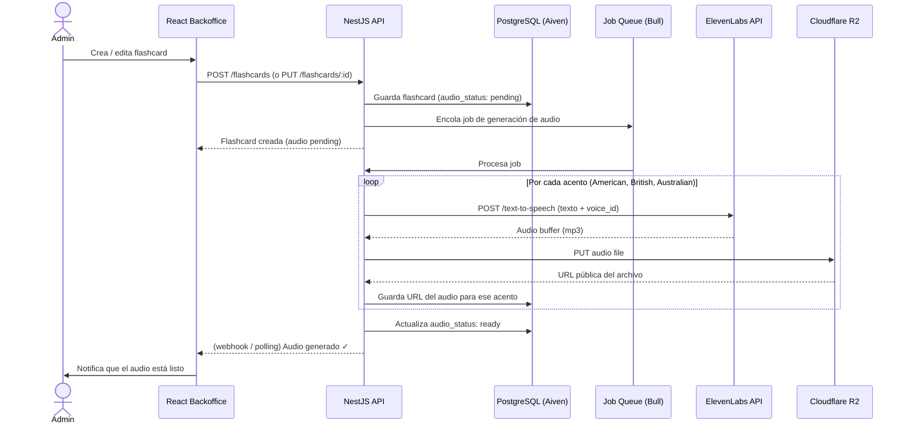

# Audio Generation Pipeline

## Notas

- La generación es **asíncrona** — el admin no espera bloqueado mientras ElevenLabs genera
- Bull gestiona reintentos automáticos si ElevenLabs falla o tiene timeout
- Cada flashcard puede tener hasta 3 audios: `audio_url_us`, `audio_url_uk`, `audio_url_au`
- Los archivos nunca tocan la VPS en producción — van de ElevenLabs directamente a R2 vía la API
- El backoffice puede mostrar estado `pending | generating | ready | error` por flashcard
