# Data Model

Schema derived from TypeORM entities in `apps/api/src/**/infrastructure/persistence/*.entity.ts` and migrations in `apps/api/src/shared/infrastructure/persistence/migrations/`. PostgreSQL.

```mermaid
erDiagram
    users {
        uuid id PK
        varchar email UK
        varchar password_hash "nullable — OAuth users"
        varchar nickname UK
        varchar avatar_url "nullable"
        varchar role "user|teacher|admin|premium"
        varchar oauth_provider "google|null"
        boolean show_in_ranking
        int current_streak
        int longest_streak
        date last_activity_date "nullable"
        timestamp created_at
        timestamp updated_at
    }

    user_sessions {
        uuid id PK
        varchar token_id UK
        uuid owner_id "nullable — guest tokens have no user row"
        varchar owner_type "user|guest"
        varchar device_id
        text fingerprint
        timestamp expires_at
        timestamp revoked_at "nullable"
        timestamp created_at
    }

    flashcards {
        uuid id PK
        varchar expression
        text meaning
        varchar category "native_sounds|connected_speech|flow_connectors|real_talk"
        varchar subcategory
        varchar ipa_notation "nullable"
        varchar native_speech "nullable"
        varchar audio_status "pending|generating|ready|failed"
        jsonb audio_urls "nullable"
        jsonb examples "[] default"
        uuid created_by FK
        timestamp created_at
        timestamp updated_at
        timestamptz deleted_at "nullable — soft delete"
    }

    games {
        uuid id PK
        uuid user_id FK "nullable — guest games migrated later"
        varchar mode "study|game"
        varchar module "nullable"
        varchar subcategory "nullable"
        varchar source "catalog — default"
        varchar card_count "10|20|50"
        varchar status "in_progress|paused|completed|abandoned"
        uuid last_flashcard_id FK "nullable — for resume"
        timestamp started_at
        timestamp finished_at "nullable"
    }

    game_flashcards {
        uuid game_id PK,FK
        int position PK
        uuid flashcard_id FK
    }

    attempts {
        uuid id PK
        uuid game_id FK
        uuid flashcard_id FK
        boolean correct
        timestamp answered_at
    }

    user_flashcard_stats {
        uuid user_id PK,FK
        uuid flashcard_id PK,FK
        int times_studied
        int times_played
        int correct_count
        decimal accuracy_rate "0.0000–1.0000"
        timestamp last_seen_at
    }

    module_progress {
        uuid user_id PK,FK
        varchar module PK
        int total_attempts
        int correct_count
        decimal accuracy
        smallint mastery_level "0–3"
        timestamp last_played_at
        timestamp updated_at
    }

    ranking_user_scores {
        uuid user_id PK,FK
        varchar type PK
        varchar period PK
        varchar period_bucket PK "default rolling"
        varchar module PK "default global"
        varchar nickname
        decimal score
        timestamp updated_at
    }

    achievement_catalog {
        varchar key PK
        varchar title
        text description
        varchar category "game|streak|module|study"
        int sort_order
    }

    user_achievements {
        uuid user_id PK,FK
        varchar achievement_key PK,FK
        timestamp unlocked_at
    }

    user_achievement_progress {
        uuid user_id PK,FK
        int completed_games_count
        int completed_study_sessions_count
        int total_played_attempts
        jsonb touched_modules "[] default"
    }

    game_views {
        uuid id PK
        uuid game_id FK
        uuid flashcard_id
        timestamp viewed_at
    }

    page_views {
        uuid id PK
        varchar path
        varchar visitor_id
        uuid user_id FK "nullable"
        varchar referrer "nullable"
        timestamp created_at
    }

    processed_events {
        uuid event_id PK
        varchar handler PK
        timestamp processed_at
    }

    users ||--o{ games : "plays"
    users ||--o{ user_flashcard_stats : "has"
    users ||--o{ module_progress : "tracks"
    users ||--o{ ranking_user_scores : "appears in"
    users ||--o{ user_achievements : "earns"
    users ||--o{ user_achievement_progress : "has"
    users ||--o{ user_sessions : "owns (or null for guest)"
    users ||--o{ page_views : "viewed as"
    users ||--o{ flashcards : "created_by"

    flashcards ||--o{ game_flashcards : "selected in"
    flashcards ||--o{ attempts : "answered in"
    flashcards ||--o{ user_flashcard_stats : "tracked in"
    flashcards ||--o{ game_views : "viewed in"

    games ||--o{ game_flashcards : "includes"
    games ||--o{ attempts : "contains"
    games ||--o{ game_views : "tracks views"

    achievement_catalog ||--o{ user_achievements : "unlocks"
```

## Notas

### Sobre las tablas

- **`users.role`** — `user | teacher | admin | premium` (check constraint a nivel DB). `premium` está reservado y no tiene lógica en MVP.
- **`users.password_hash`** — `null` para usuarios OAuth (Google).
- **`flashcards.audio_urls`** — JSONB con estructura `{ expression: { us, uk, au }, examples: { us } }`. `audio_status` refleja el ciclo: `pending → generating → ready | failed`.
- **`flashcards.examples`** — JSONB inline (1–3 ejemplos). NO existe tabla `flashcard_examples` separada — es un jsonb denormalizado en `flashcards`.
- **`games.card_count`** — VARCHAR con check constraint: `IN ('10','20','50')`.
- **`games.user_id`** — nullable para soportar migración de partidas guest (`MigrateGuestProgressUseCase`).
- **`game_flashcards`** — N:M con `position` PK compuesta para garantizar el orden de presentación.
- **`attempts`** — se persisten en tiempo real al INSERT, no al final del game.
- **`user_flashcard_stats`** — PK compuesta `(user_id, flashcard_id)`. `accuracy_rate` se recalcula en write-time.
- **`module_progress.mastery_level`** — `0–3`, calculado a partir de `total_attempts + accuracy`.
- **`ranking_user_scores`** — PK compuesta `(user_id, type, period, period_bucket, module)`. Tabla anterior `rankings_cache + ranking_metadata` fue reemplazada por esta (ver migration `202606200600001779990000003`). Rank (posición) NO se almacena, se calcula con `RANK() OVER`.
- **`user_achievements`** — PK compuesta `(user_id, achievement_key)`, FK a `achievement_catalog`.
- **`processed_events`** — Inbox pattern para idempotencia de subscribers AMQP. PK compuesta `(event_id, handler)`.

### Tablas planeadas pero NO migradas

Las siguientes tablas aparecen en `docs/domain/db-schema.md` pero **no existen** en ninguna migración actual — se omiten del diagrama ER. Si en el futuro se construyen, se deben añadir vía nueva migración TypeORM:

> **planned / not migrated**
>
> - `pronunciation_attempts (id, user_id, flashcard_id, score, phonemes jsonb, created_at)` — prevista para evaluación de pronunciación (Azure Speech). Sin tabla ni entity en el repo a fecha de hoy.
> - `users.push_subscription jsonb` — prevista para Web Push API (endpoint + keys). El campo NO está en `UserEntity.ts` ni en la migración inicial de `users`. Si se añade, requiere nueva migration.

## Source files verified

- `apps/api/src/identity/user/infrastructure/persistence/user.entity.ts`
- `apps/api/src/identity/session/infrastructure/persistence/user-session.entity.ts`
- `apps/api/src/content/flashcard/infrastructure/persistence/flashcard.entity.ts`
- `apps/api/src/gaming/infrastructure/persistence/game.entity.ts`
- `apps/api/src/gaming/infrastructure/persistence/game-flashcard.entity.ts`
- `apps/api/src/gaming/infrastructure/persistence/typeorm-attempt.repository.ts`
- `apps/api/src/achievement/user-achievement/infrastructure/persistence/user-achievement.entity.ts`
- `apps/api/src/achievement/progress/infrastructure/persistence/user-achievement-progress.entity.ts`
- `apps/api/src/analytics/page-view/infrastructure/persistence/page-view.entity.ts`
- `apps/api/src/shared/infrastructure/persistence/migrations/Migration202605230526271779506787479.ts` (users, refresh_tokens)
- `apps/api/src/shared/infrastructure/persistence/migrations/Migration202605241854361779641676650.ts` (refresh_tokens → user_sessions)
- `apps/api/src/shared/infrastructure/persistence/migrations/Migration202605251200001779720000000.ts` (flashcards)
- `apps/api/src/shared/infrastructure/persistence/migrations/Migration202605281913001779988354467.ts` (user_flashcard_stats)
- `apps/api/src/shared/infrastructure/persistence/migrations/Migration202605281913201779988375165.ts` (module_progress, processed_events)
- `apps/api/src/shared/infrastructure/persistence/migrations/Migration1779773389320.ts` (games, game_flashcards, attempts)
- `apps/api/src/shared/infrastructure/persistence/migrations/Migration202606200410001779990000001.ts` (rankings_cache, ranking_metadata — iniciales)
- `apps/api/src/shared/infrastructure/persistence/migrations/Migration202606200600001779990000003.ts` (ranking_user_scores — reemplazo)
- `apps/api/src/shared/infrastructure/persistence/migrations/Migration202606261200001779990000005.ts` (games.subcategory)
- `apps/api/src/shared/infrastructure/persistence/migrations/Migration202606271200001779990000006.ts` (achievement_catalog, user_achievements, games.source)
- `apps/api/src/shared/infrastructure/persistence/migrations/Migration202606291000001779990000007.ts` (page_views)
- `apps/api/src/shared/infrastructure/persistence/migrations/Migration202606291200001779990000008.ts` (game_views)
- `apps/api/src/shared/infrastructure/persistence/migrations/Migration202606301200001779990000009.ts` (achievement_catalog extend)
- `apps/api/src/shared/infrastructure/persistence/migrations/Migration202606301400001779990000010.ts` (user_achievement_progress)
- `apps/api/src/shared/infrastructure/persistence/migrations/Migration202607080500001779990000011.ts` (flashcards.deleted_at)