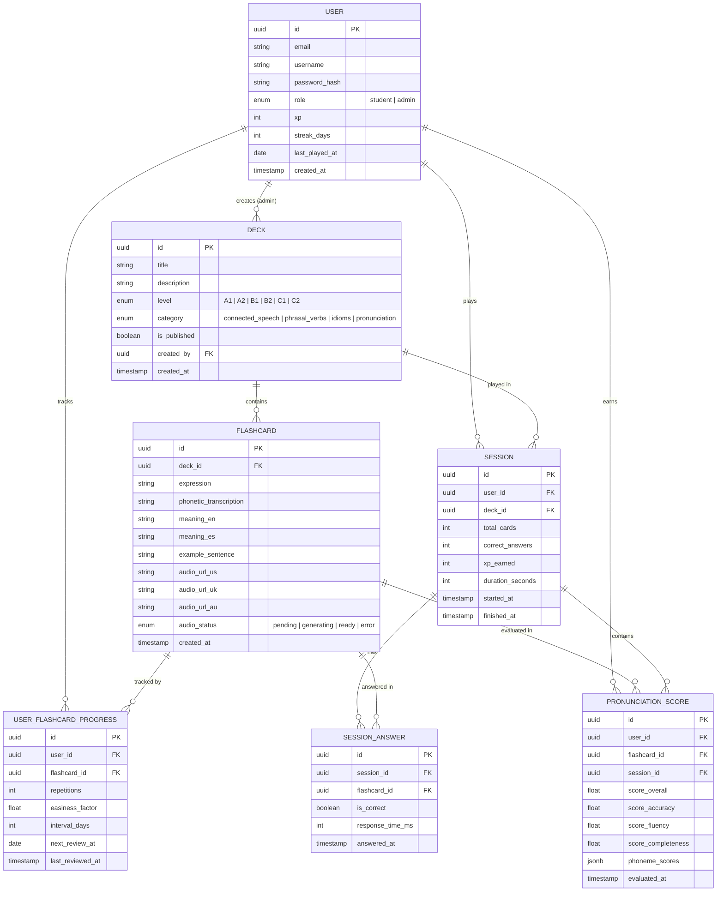

# Data Model

## Notas

- `USER_FLASHCARD_PROGRESS` implementa el algoritmo SM-2 de spaced repetition (`easiness_factor`, `interval_days`, `next_review_at`)
- `phoneme_scores` es `jsonb` — la estructura que devuelve Azure Speech varía por palabra, no vale la pena normalizar
- `audio_status` en `FLASHCARD` refleja el estado del pipeline de ElevenLabs (ver diagrama de audio pipeline)
- `SESSION_ANSWER` guarda `response_time_ms` para métricas de dificultad percibida por flashcard
- `role` en `USER` determina acceso al backoffice de admin
