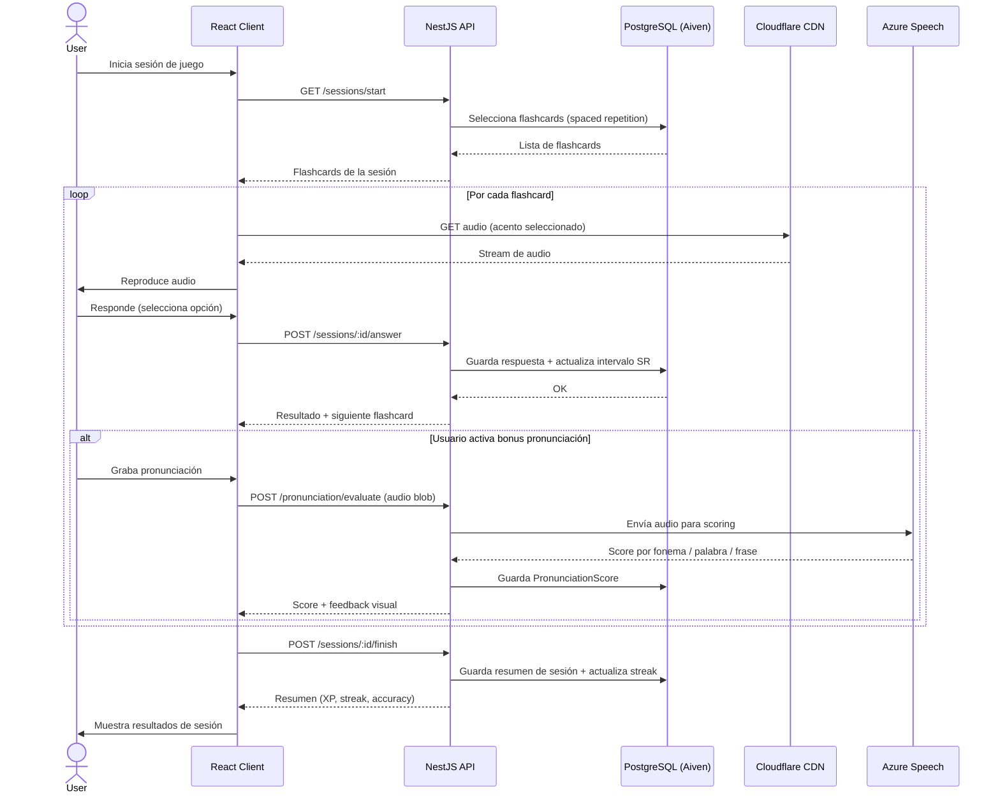

# Flashcard Game Flow

## Notas

- El algoritmo de spaced repetition determina qué flashcards aparecen y en qué orden
- El audio se sirve siempre desde Cloudflare — nunca desde la API
- El bonus de pronunciación es opcional por flashcard — el usuario decide si lo activa
- Al finalizar la sesión se actualiza el streak y se calculan los puntos de XP
