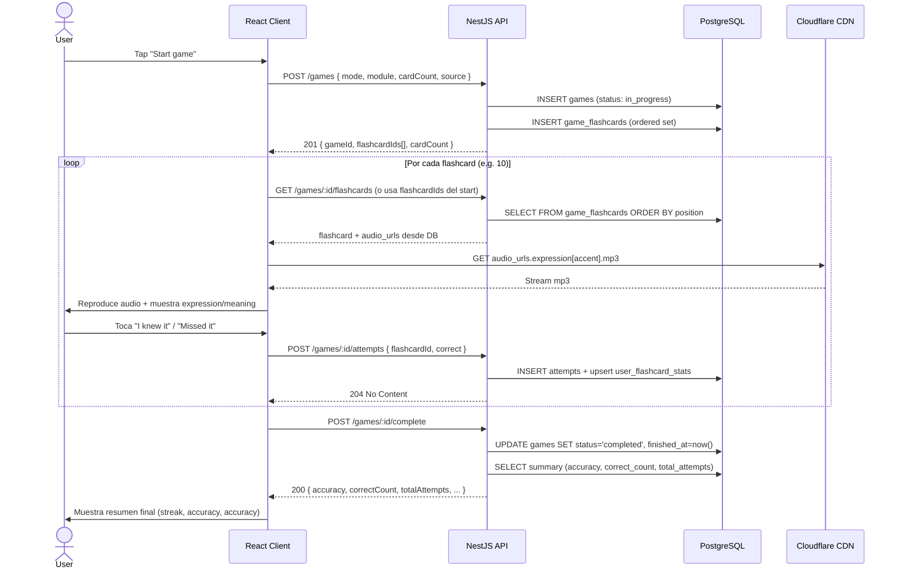
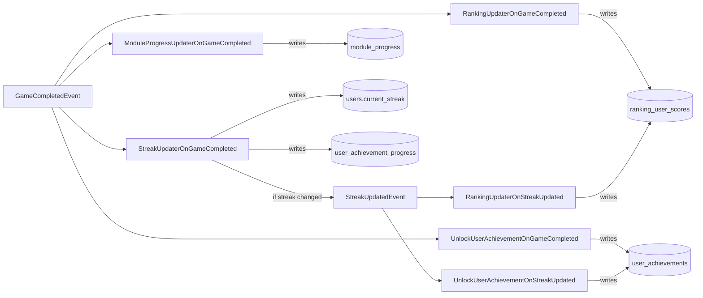

# Flashcard Game Flow

Real game lifecycle through the `games/*` endpoints. Audio served from Cloudflare CDN (no pronunciation scoring, no SM-2 — those don't exist yet).

## Event chain tras `POST /games/:id/complete`

El aggregate `Game` registra `GameCompletedEvent` al completar. AMQP lo entrega a **varios subscribers en paralelo**:

| Subscriber | Subscribes to | Writes to | Notes |
|---|---|---|---|
| `ModuleProgressUpdaterOnGameCompleted` | `GameCompletedEvent` | `module_progress` | recalcula `mastery_level` |
| `RankingUpdaterOnGameCompleted` | `GameCompletedEvent` | `ranking_user_scores` | global score update |
| `UnlockUserAchievementOnGameCompleted` | `GameCompletedEvent` | `user_achievements` | via `GameCompletedAchievementUnlockPolicy` |
| `StreakUpdaterOnGameCompleted` | `GameCompletedEvent` | `users` + `user_achievement_progress` | may emit `StreakUpdatedEvent` |

## Notas

- **No SM-2, no XP, no Azure Speech.** Estos conceptos no existen en el código actual. La selección de flashcards para un game es por módulo/subcategoría/random — no por algoritmo de repetición espaciada.
- **Audio siempre desde CDN.** El campo `flashcards.audio_urls.expression.{us,uk,au}` apunta a R2/Cloudflare — la API nunca sirve binarios.
- **Accent selection es client-side.** El cliente elige `us | uk | au` del audio a reproducir; no se persiste preferencia por usuario.
- **Endpoints reales** (ver `apps/api/src/gaming/infrastructure/controllers/`):
  - `POST /games` — start (cualquier user o guest con `AnyAuthGuard`)
  - `GET /games/:id/flashcards` — lista ordenada de cartas
  - `POST /games/:id/attempts` — registra respuesta (204 No Content)
  - `POST /games/:id/complete` — completa y devuelve summary
  - `GET /games/:id/summary` — summary on-demand (también al completar)
  - `POST /games/:id/pause` + `POST /games/:id/resume` — flujo paused
  - `PATCH /games/:id` — patch parcial (e.g. last_flashcard_id)
- **Idempotencia** — `INSERT INTO attempts ... ON CONFLICT (id) DO NOTHING` (ver `typeorm-attempt.repository.ts:17-21`).
- **Resume desde pausa** — `games.last_flashcard_id` guarda la última carta vista; el cliente puede continuar desde ahí.

## Source files verified

- `apps/api/src/gaming/infrastructure/controllers/start-game-post.controller.ts`
- `apps/api/src/gaming/infrastructure/controllers/record-attempt-post.controller.ts`
- `apps/api/src/gaming/infrastructure/controllers/complete-game-post.controller.ts`
- `apps/api/src/gaming/infrastructure/controllers/find-game-summary-get.controller.ts`
- `apps/api/src/gaming/infrastructure/controllers/search-game-flashcards-get.controller.ts`
- `apps/api/src/gaming/application/start/game-starter.ts`
- `apps/api/src/gaming/application/complete/game-completer.ts`
- `apps/api/src/gaming/application/attempt/attempt-recorder.ts`
- `apps/api/src/gaming/infrastructure/persistence/typeorm-attempt.repository.ts`
- `apps/api/src/progress/application/update/update-module-progress-on-game-completed.ts`
- `apps/api/src/ranking/projection/application/update/ranking-updater-on-game-completed.ts`
- `apps/api/src/ranking/projection/application/update/ranking-updater-on-streak-updated.ts`
- `apps/api/src/achievement/user-achievement/application/unlock/unlock-user-achievement-on-game-completed.ts`
- `apps/api/src/achievement/user-achievement/application/unlock/unlock-user-achievement-on-streak-updated.ts`
- `apps/api/src/identity/user/application/update-streak/update-streak-on-game-completed.ts`
- `apps/api/src/gaming/domain/events/game-completed.event.ts`
- `apps/api/src/identity/user/domain/events/streak-updated.event.ts`