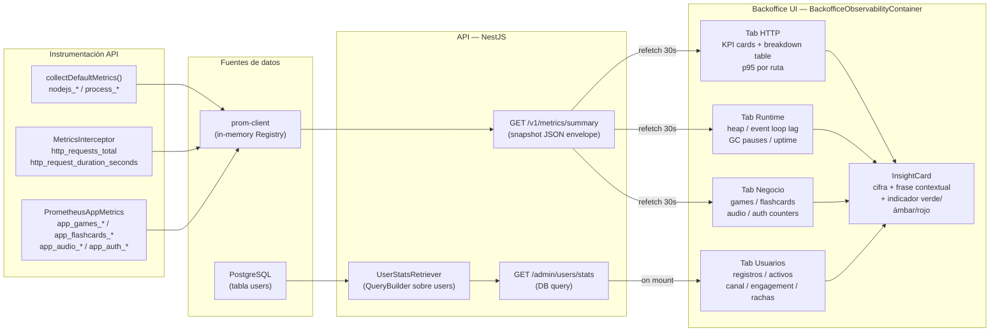
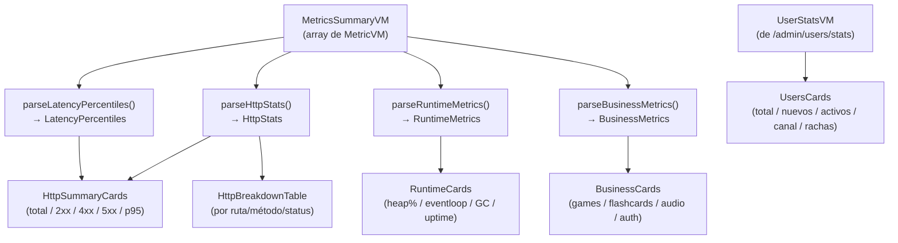
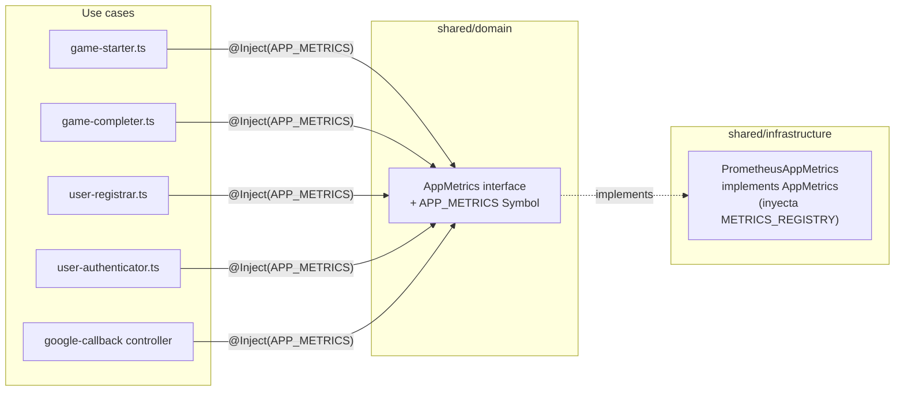

# Diagrama: Backoffice Observability — Flujo de datos

> Muestra el flujo completo desde las fuentes de datos (Prometheus + PostgreSQL) hasta los cuatro tabs de la UI del backoffice con la capa InsightCard.

---

## Flujo completo

---

## Parsers del frontend por tab

---

## Arquitectura Clean — AppMetrics port

