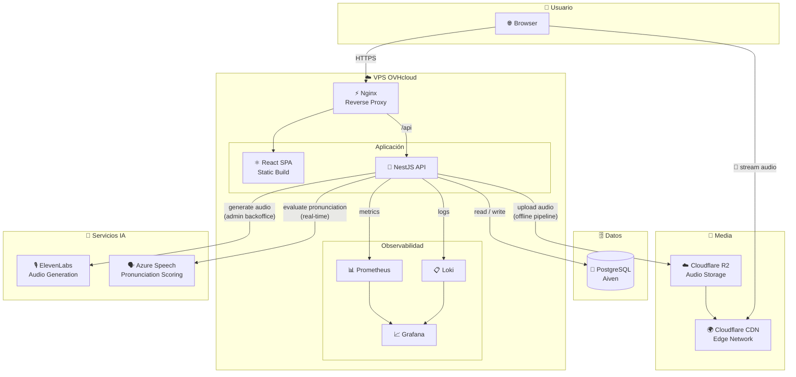

# System Architecture

## Flujo de datos clave

| Flujo | Ruta |
|---|---|
| Usuario juega | Browser → Nginx → API → DB |
| Usuario escucha audio | Browser → Cloudflare CDN (nunca pasa por la VPS) |
| Admin crea flashcard | API → ElevenLabs → Cloudflare R2 |
| Usuario practica pronunciación | Browser → API → Azure Speech |
| Métricas y logs | API → Prometheus / Loki → Grafana |
