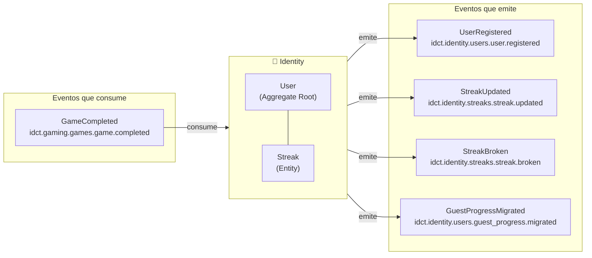
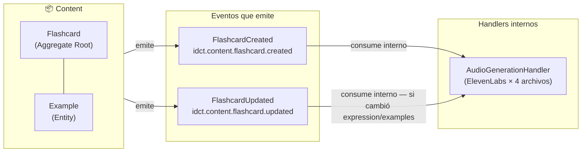
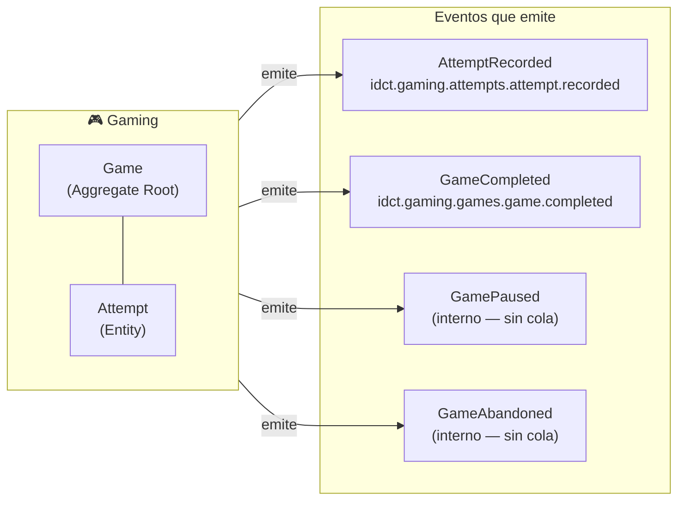
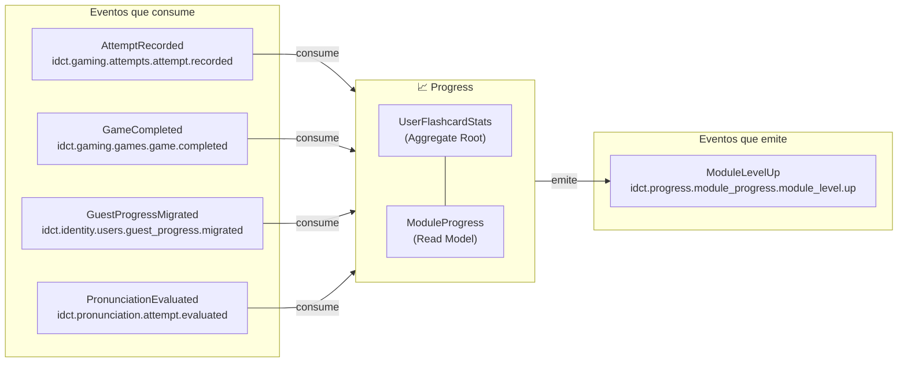
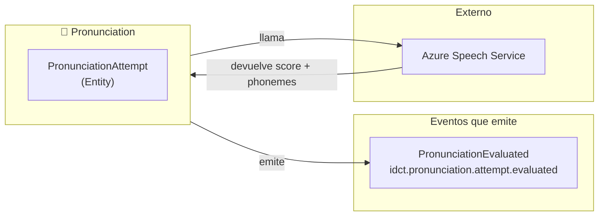
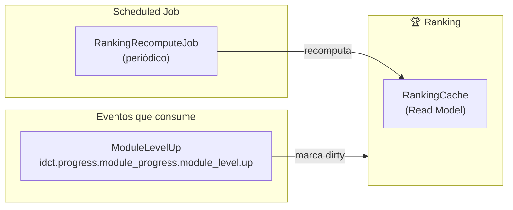
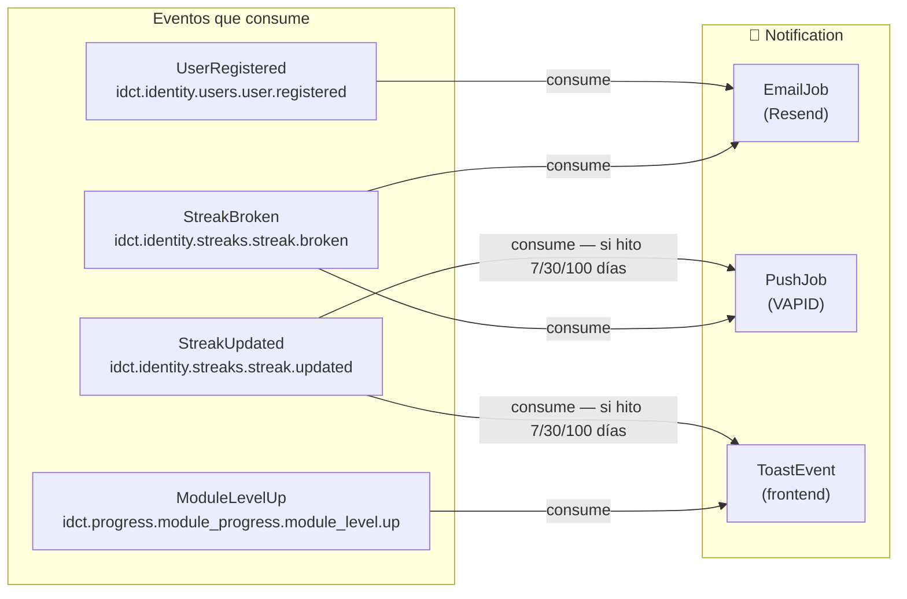

# Bounded Contexts — Detalle por contexto

Eventos que emite y consume cada bounded context, con sus aggregates internos y responsabilidades.

---

## 🔐 Identity

**Responsabilidad**: Gestionar la identidad del usuario, autenticación y racha de actividad.

| Evento emitido | Exchange | Trigger |
|----------------|----------|---------|
| `UserRegistered` | `idct.identity.users.user.registered` | Usuario completa registro (email o OAuth) |
| `StreakUpdated` | `idct.identity.streaks.streak.updated` | `GameCompleted` o sesión de estudio — primera del día |
| `StreakBroken` | `idct.identity.streaks.streak.broken` | Job nocturno detecta que `last_activity_date < ayer` |
| `GuestProgressMigrated` | `idct.identity.users.guest_progress.migrated` | Guest completa registro y envía estado Zustand |

| Evento consumido | Exchange | Acción |
|-----------------|----------|--------|
| `GameCompleted` | `idct.gaming.games.game.completed` | Evalúa si incrementar streak (una vez por día) |

---

## 📦 Content

**Responsabilidad**: Gestionar el catálogo de flashcards y el pipeline de generación de audio.

| Evento emitido | Exchange | Trigger |
|----------------|----------|---------|
| `FlashcardCreated` | `idct.content.flashcard.created` | Teacher publica nueva flashcard (manual, bulk JSON o PDF) |
| `FlashcardUpdated` | `idct.content.flashcard.updated` | Teacher edita una flashcard existente |

| Evento consumido | Exchange | Acción |
|-----------------|----------|--------|
| `FlashcardCreated` | `idct.content.flashcard.created` | AudioGenerationHandler → ElevenLabs → CDN → `audio_status: ready` |
| `FlashcardUpdated` | `idct.content.flashcard.updated` | AudioGenerationHandler (solo si cambió `expression` o `examples`) |

---

## 🎮 Gaming

**Responsabilidad**: Gestionar el ciclo de vida de los juegos y registrar los intentos del usuario.

| Evento emitido | Exchange | Trigger |
|----------------|----------|---------|
| `AttemptRecorded` | `idct.gaming.attempts.attempt.recorded` | Usuario responde una flashcard (✓ o ✗) — inmediato |
| `GameCompleted` | `idct.gaming.games.game.completed` | Usuario termina todas las flashcards del game |
| `GamePaused` | — interno | Usuario sale de la pantalla / inactividad > 15 min / acción explícita |
| `GameAbandoned` | — interno | Usuario elige abandonar explícitamente / FIFO al superar 5 pausados |

> `GamePaused` y `GameAbandoned` son eventos de dominio internos — no se publican al bus ya que ningún otro BC los consume.

---

## 📈 Progress

**Responsabilidad**: Materializar y mantener el progreso del usuario por flashcard y por módulo.

| Evento consumido | Exchange | Acción |
|-----------------|----------|--------|
| `AttemptRecorded` | `idct.gaming.attempts.attempt.recorded` | UPSERT `user_flashcard_stats` — actualiza `times_played`, `correct_count`, `accuracy_rate` |
| `GameCompleted` | `idct.gaming.games.game.completed` | Recalcula `ModuleProgress` (study/mastery/combined level) |
| `GuestProgressMigrated` | `idct.identity.users.guest_progress.migrated` | Bulk UPSERT `user_flashcard_stats` desde historial guest |
| `PronunciationEvaluated` | `idct.pronunciation.attempt.evaluated` | Actualiza pronunciation stats en `user_flashcard_stats` |

| Evento emitido | Exchange | Trigger |
|----------------|----------|---------|
| `ModuleLevelUp` | `idct.progress.module_progress.module_level.up` | Recálculo de `ModuleProgress` detecta subida de nivel |

---

## 🎤 Pronunciation

**Responsabilidad**: Evaluar la pronunciación del usuario y emitir el resultado.

| Evento emitido | Exchange | Trigger |
|----------------|----------|---------|
| `PronunciationEvaluated` | `idct.pronunciation.attempt.evaluated` | Azure devuelve resultado → se persiste `PronunciationAttempt` |

---

## 🏆 Ranking

**Responsabilidad**: Mantener rankings materializados para lectura eficiente.

| Evento consumido | Exchange | Acción |
|-----------------|----------|--------|
| `ModuleLevelUp` | `idct.progress.module_progress.module_level.up` | Marca ranking como `dirty` → recomputado en próximo job |

**No emite eventos.** Es un pure read model — solo responde a queries.

Fuentes de datos para el cálculo:
- `user_flashcard_stats` → accuracy, flashcards acertadas, module level
- `games` → partidas jugadas
- `users` → streak actual

---

## 🔔 Notification

**Responsabilidad**: Enviar notificaciones al usuario por los canales disponibles (toast, push, email).

| Evento consumido | Exchange | Canal | Condición |
|-----------------|----------|-------|-----------|
| `UserRegistered` | `idct.identity.users.user.registered` | Email (Resend) | Siempre |
| `StreakUpdated` | `idct.identity.streaks.streak.updated` | Toast + Push | Solo si hito (7, 30, 100 días) |
| `StreakBroken` | `idct.identity.streaks.streak.broken` | Email + Push | Siempre que streak > 0 |
| `ModuleLevelUp` | `idct.progress.module_progress.module_level.up` | Toast | Siempre |

**No emite eventos.** Es un pure consumer — solo ejecuta side effects.
